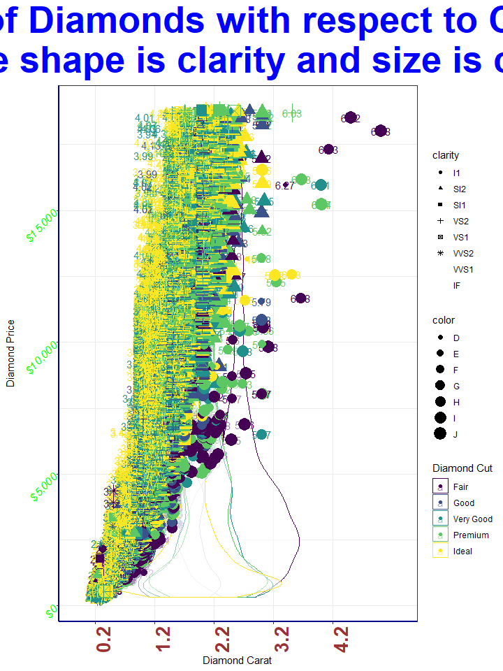

Skills Assessment 1 - ggplot 2
================
Tom Blackwood
01/12/2020

## Skills Assessment part 1

The purpose of this assessment is to alter the code below and try to
make the plot as difficult/distracting as possible.

``` r
ggplot(diamonds, aes(x = carat, y = price, colour = cut)) + 
  geom_point() # + ...
```

The head of the data is:

``` r
head(diamonds) 
```

    ## # A tibble: 6 x 10
    ##   carat cut       color clarity depth table price     x     y     z
    ##   <dbl> <ord>     <ord> <ord>   <dbl> <dbl> <int> <dbl> <dbl> <dbl>
    ## 1 0.23  Ideal     E     SI2      61.5    55   326  3.95  3.98  2.43
    ## 2 0.21  Premium   E     SI1      59.8    61   326  3.89  3.84  2.31
    ## 3 0.23  Good      E     VS1      56.9    65   327  4.05  4.07  2.31
    ## 4 0.290 Premium   I     VS2      62.4    58   334  4.2   4.23  2.63
    ## 5 0.31  Good      J     SI2      63.3    58   335  4.34  4.35  2.75
    ## 6 0.24  Very Good J     VVS2     62.8    57   336  3.94  3.96  2.48

And highlighting some data by adding a few features:

``` r
p1 <- ggplot(diamonds, aes(x = carat, y = price, colour = cut)) + theme_bw() +
  geom_text(aes(label=round(z, 2))) +
  geom_violin(alpha = 0.5) +
  geom_point(aes(shape =  clarity, size = color)) + 
  
  ggtitle("Price of Diamonds with respect to Carat,\n where shape is clarity and size is color") +
  labs(x = "Diamond Carat", y = "Diamond Price", colour = "Diamond Cut") + 
  
  theme(
    plot.title = element_text(size = 40, face = "bold", colour = "blue", hjust = 0.5),
    axis.line = element_line(color = "darkblue", size = 1, linetype = "solid"),
    axis.text.x = element_text(face = "bold", color = "#993333", size = 20, angle = 90, hjust = 0.5),
    axis.text.y = element_text(face = "italic", color = "green", size = 12, angle = 45)
  ) +
  
  scale_x_discrete(limits=min(diamonds$carat):max(diamonds$carat))+
  scale_y_continuous(labels = dollar)
```

    ## Warning: Continuous limits supplied to discrete scale.
    ## Did you mean `limits = factor(...)` or `scale_*_continuous()`?

``` r
p1
```

    ## Warning: Using shapes for an ordinal variable is not advised

    ## Warning: position_dodge requires non-overlapping x intervals

    ## Warning: The shape palette can deal with a maximum of 6 discrete values because
    ## more than 6 becomes difficult to discriminate; you have 8. Consider
    ## specifying shapes manually if you must have them.

    ## Warning: Removed 5445 rows containing missing values (geom_point).

<!-- -->
