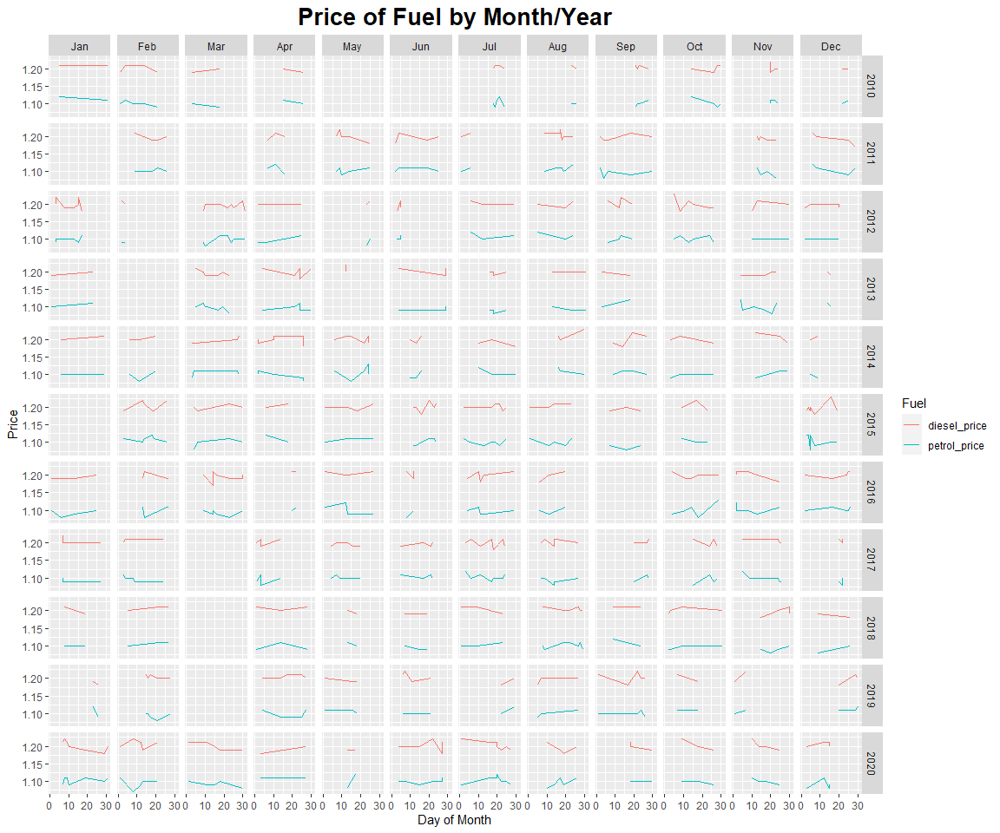

Skills Test 2
================
Tom Blackwood
10/12/2020

## Assignment 2

Fuel data is randomly generated and written to a `.CSV`. The Seed for
the random generation is set ot 72 and the sample size is set to
7,216,516,166.

``` r
# set seed and sample size
set.seed(72) # change this
sample_size <- 7216516166 # feel free to increase this

# create randomised tibble/data frame
fuel_data <- tibble(
  year = sample(c(2010:2020), min(500, sample_size), replace = TRUE),
  month = sample(c(1:12), min(500, sample_size), replace = TRUE),
  day = sample(c(1:31), min(500, sample_size), replace = TRUE),
  petrol_price = round(rnorm(min(500, sample_size), 110, 1)/100, 2),
  diesel_price = round(rnorm(min(500, sample_size), 120, 1)/100, 2)
)

# write fuel_data to file
write.csv(fuel_data, "fuel_data.csv", row.names=FALSE)
```

The data is then read from the csv and a summary says what’s in the
data.

``` r
# read file in 
fuel_data2 <- read.csv("fuel_data.csv")

# summarise data in at least one way
head(fuel_data2)
```

    ##   year month day petrol_price diesel_price
    ## 1 2012     3  24         1.09         1.20
    ## 2 2016    12  24         1.10         1.20
    ## 3 2014     4  10         1.10         1.20
    ## 4 2019     6  11         1.10         1.19
    ## 5 2013     9  18         1.12         1.19
    ## 6 2019     4  14         1.09         1.20

``` r
summary(fuel_data2)
```

    ##       year          month            day         petrol_price   diesel_price 
    ##  Min.   :2010   Min.   : 1.00   Min.   : 1.00   Min.   :1.07   Min.   :1.17  
    ##  1st Qu.:2012   1st Qu.: 4.00   1st Qu.: 9.00   1st Qu.:1.09   1st Qu.:1.19  
    ##  Median :2015   Median : 7.00   Median :16.00   Median :1.10   Median :1.20  
    ##  Mean   :2015   Mean   : 6.51   Mean   :16.06   Mean   :1.10   Mean   :1.20  
    ##  3rd Qu.:2018   3rd Qu.: 9.00   3rd Qu.:24.00   3rd Qu.:1.11   3rd Qu.:1.21  
    ##  Max.   :2020   Max.   :12.00   Max.   :31.00   Max.   :1.13   Max.   :1.23

The data is then articulated to be plotted. A new column is created for
the `date` so the fuel prices can be pivoted longer to plot both fuels
on the same graph.

The `month` number is replaced with the month value and the dates that
generated warnings are dropped from the set.

A facet grid plot is created using the `months` for one axis of the grid
and the `years` for the other axis. The days of the month are posted
along the `x-axis` and the price along the `y-axis`.

``` r
# plot the data in at least one way
fuel_data2$date <- with(fuel_data2, ymd(paste(year, month, day, sep="-")))
```

    ## Warning: 12 failed to parse.

``` r
fuel_data3 <- fuel_data2 %>% 
  pivot_longer(cols = petrol_price:diesel_price, names_to = 'fuel', values_to = 'price')

fuel_data3$month <- month(as.Date(fuel_data3$date), label=TRUE)
fuel_data3 <- fuel_data3 %>% drop_na(month)

p1 <- ggplot(fuel_data3, aes(x = day, y = price, colour=fuel)) + 
  geom_line() + 
  facet_grid(year ~ month) + 
  
  ggtitle("Price of Fuel by Month/Year") +
  labs(x = "Day of Month", y = "Price", colour = "Fuel") + 
  
  theme(
    plot.title = element_text(size = 20, face = "bold", hjust = 0.5),
  )

p1
```

    ## geom_path: Each group consists of only one observation. Do you need to adjust
    ## the group aesthetic?
    ## geom_path: Each group consists of only one observation. Do you need to adjust
    ## the group aesthetic?
    ## geom_path: Each group consists of only one observation. Do you need to adjust
    ## the group aesthetic?
    ## geom_path: Each group consists of only one observation. Do you need to adjust
    ## the group aesthetic?
    ## geom_path: Each group consists of only one observation. Do you need to adjust
    ## the group aesthetic?
    ## geom_path: Each group consists of only one observation. Do you need to adjust
    ## the group aesthetic?
    ## geom_path: Each group consists of only one observation. Do you need to adjust
    ## the group aesthetic?
    ## geom_path: Each group consists of only one observation. Do you need to adjust
    ## the group aesthetic?
    ## geom_path: Each group consists of only one observation. Do you need to adjust
    ## the group aesthetic?
    ## geom_path: Each group consists of only one observation. Do you need to adjust
    ## the group aesthetic?

<!-- -->
