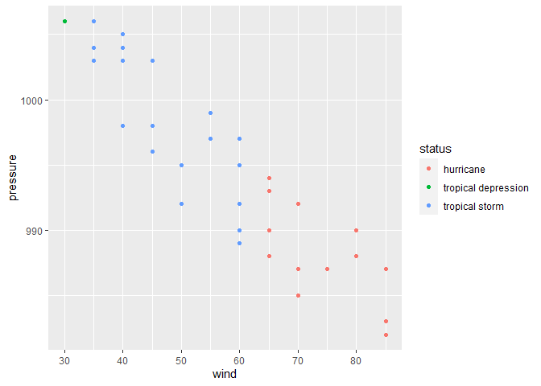
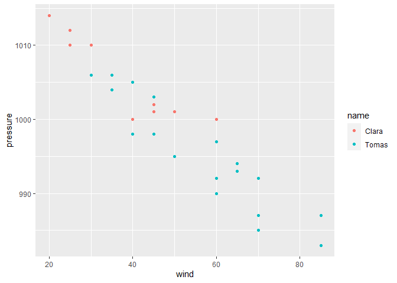

<<<<<<< HEAD
Tutorial 2 - Manipulating data with dplyr
================
Tom Blackwood
10/11/2020

## Exercise 1 - Using the `select` function

Using the `select` function pulls columns that are selected from a data
frame. Using **storms** as the source, the *numerical values* can be
grabbed the.

    ## # A tibble: 10,010 x 10
    ##     year month   day  hour   lat  long  wind pressure ts_diameter hu_diameter
    ##    <dbl> <dbl> <int> <dbl> <dbl> <dbl> <int>    <int>       <dbl>       <dbl>
    ##  1  1975     6    27     0  27.5 -79      25     1013          NA          NA
    ##  2  1975     6    27     6  28.5 -79      25     1013          NA          NA
    ##  3  1975     6    27    12  29.5 -79      25     1013          NA          NA
    ##  4  1975     6    27    18  30.5 -79      25     1013          NA          NA
    ##  5  1975     6    28     0  31.5 -78.8    25     1012          NA          NA
    ##  6  1975     6    28     6  32.4 -78.7    25     1012          NA          NA
    ##  7  1975     6    28    12  33.3 -78      25     1011          NA          NA
    ##  8  1975     6    28    18  34   -77      30     1006          NA          NA
    ##  9  1975     6    29     0  34.4 -75.8    35     1004          NA          NA
    ## 10  1975     6    29     6  34   -74.8    40     1002          NA          NA
    ## # ... with 10,000 more rows

or the *character values* can be used.

    ## # A tibble: 10,010 x 2
    ##    name  status             
    ##    <chr> <chr>              
    ##  1 Amy   tropical depression
    ##  2 Amy   tropical depression
    ##  3 Amy   tropical depression
    ##  4 Amy   tropical depression
    ##  5 Amy   tropical depression
    ##  6 Amy   tropical depression
    ##  7 Amy   tropical depression
    ##  8 Amy   tropical depression
    ##  9 Amy   tropical storm     
    ## 10 Amy   tropical storm     
    ## # ... with 10,000 more rows

The columns can even be selected based on looking for certain
conditions, specifically here columns with *diameter* in their name

    ## # A tibble: 10,010 x 2
    ##    ts_diameter hu_diameter
    ##          <dbl>       <dbl>
    ##  1          NA          NA
    ##  2          NA          NA
    ##  3          NA          NA
    ##  4          NA          NA
    ##  5          NA          NA
    ##  6          NA          NA
    ##  7          NA          NA
    ##  8          NA          NA
    ##  9          NA          NA
    ## 10          NA          NA
    ## # ... with 10,000 more rows

Using the `%like%` function from the `data.table` library, partial
string matches within the columns can be selected. Here, **tropical** is
used to select both *tropical depression* and *tropical storm*

    ## # A tibble: 6,919 x 13
    ##    name   year month   day  hour   lat  long status category  wind pressure
    ##    <chr> <dbl> <dbl> <int> <dbl> <dbl> <dbl> <chr>  <ord>    <int>    <int>
    ##  1 Amy    1975     6    27     0  27.5 -79   tropi~ -1          25     1013
    ##  2 Amy    1975     6    27     6  28.5 -79   tropi~ -1          25     1013
    ##  3 Amy    1975     6    27    12  29.5 -79   tropi~ -1          25     1013
    ##  4 Amy    1975     6    27    18  30.5 -79   tropi~ -1          25     1013
    ##  5 Amy    1975     6    28     0  31.5 -78.8 tropi~ -1          25     1012
    ##  6 Amy    1975     6    28     6  32.4 -78.7 tropi~ -1          25     1012
    ##  7 Amy    1975     6    28    12  33.3 -78   tropi~ -1          25     1011
    ##  8 Amy    1975     6    28    18  34   -77   tropi~ -1          30     1006
    ##  9 Amy    1975     6    29     0  34.4 -75.8 tropi~ 0           35     1004
    ## 10 Amy    1975     6    29     6  34   -74.8 tropi~ 0           40     1002
    ## # ... with 6,909 more rows, and 2 more variables: ts_diameter <dbl>,
    ## #   hu_diameter <dbl>

## Exercise 2 - `mutate() across() everything()`. “*Everything, sir?*”, “**EVERYTHING\!\!\!**”

Continuing with the **storms** data, the `mutate()` function combined
with `across()` and `everything()` change the values of the data frame
to make everything the same type. In the example below, the **storms**
data is mutated using the `mutate()` function. Where the changes are set
to be done across the whole data frame using `across()`, and using every
data type is selected by `everything()`. The data type the selected to
mutate into is *character* or `chr`.

    ## # A tibble: 10,010 x 13
    ##    name  year  month day   hour  lat   long  status category wind  pressure
    ##    <chr> <chr> <chr> <chr> <chr> <chr> <chr> <chr>  <chr>    <chr> <chr>   
    ##  1 Amy   1975  6     27    0     27.5  -79   tropi~ -1       25    1013    
    ##  2 Amy   1975  6     27    6     28.5  -79   tropi~ -1       25    1013    
    ##  3 Amy   1975  6     27    12    29.5  -79   tropi~ -1       25    1013    
    ##  4 Amy   1975  6     27    18    30.5  -79   tropi~ -1       25    1013    
    ##  5 Amy   1975  6     28    0     31.5  -78.8 tropi~ -1       25    1012    
    ##  6 Amy   1975  6     28    6     32.4  -78.7 tropi~ -1       25    1012    
    ##  7 Amy   1975  6     28    12    33.3  -78   tropi~ -1       25    1011    
    ##  8 Amy   1975  6     28    18    34    -77   tropi~ -1       30    1006    
    ##  9 Amy   1975  6     29    0     34.4  -75.8 tropi~ 0        35    1004    
    ## 10 Amy   1975  6     29    6     34    -74.8 tropi~ 0        40    1002    
    ## # ... with 10,000 more rows, and 2 more variables: ts_diameter <chr>,
    ## #   hu_diameter <chr>

The `where()` function can be used to convert data of a specific type,
where you might want to keep *boolean* variables or *coordinates*,
`ord`, or convert integers to floats. Here the *numerals* are being
converted to *characters*.

    ## # A tibble: 10,010 x 13
    ##    name  year  month day   hour  lat   long  status category wind  pressure
    ##    <chr> <chr> <chr> <chr> <chr> <chr> <chr> <chr>  <ord>    <chr> <chr>   
    ##  1 Amy   1975  6     27    0     27.5  -79   tropi~ -1       25    1013    
    ##  2 Amy   1975  6     27    6     28.5  -79   tropi~ -1       25    1013    
    ##  3 Amy   1975  6     27    12    29.5  -79   tropi~ -1       25    1013    
    ##  4 Amy   1975  6     27    18    30.5  -79   tropi~ -1       25    1013    
    ##  5 Amy   1975  6     28    0     31.5  -78.8 tropi~ -1       25    1012    
    ##  6 Amy   1975  6     28    6     32.4  -78.7 tropi~ -1       25    1012    
    ##  7 Amy   1975  6     28    12    33.3  -78   tropi~ -1       25    1011    
    ##  8 Amy   1975  6     28    18    34    -77   tropi~ -1       30    1006    
    ##  9 Amy   1975  6     29    0     34.4  -75.8 tropi~ 0        35    1004    
    ## 10 Amy   1975  6     29    6     34    -74.8 tropi~ 0        40    1002    
    ## # ... with 10,000 more rows, and 2 more variables: ts_diameter <chr>,
    ## #   hu_diameter <chr>

## Exercise 3 - `arrange()` and `count()`

The `count()` function is used on **storms** to count the number of
elements within *year* and weighted by *name*. This returns a table
ordered by year. The `arrange()` function, with `desc()`, can be used to
change the order of the storms to give the longest active storm by how
frequently a storm name occurs in the the list by the count function.

To counter this, the `unique()` function will also be used to remove
duplicate counts where *name* and *year* are both the same. (Though
there may still be an error where a storm continues over the new year
and it may be counted twice.). Using `unique()` removes the requirement
to weight the storm by name in `count()`.

    ## # A tibble: 426 x 3
    ##     vars wt_vars      n
    ##    <dbl> <chr>    <int>
    ##  1  1975 Amy          1
    ##  2  1975 Caroline     1
    ##  3  1975 Doris        1
    ##  4  1976 Belle        1
    ##  5  1976 Gloria       1
    ##  6  1977 Anita        1
    ##  7  1977 Clara        1
    ##  8  1977 Evelyn       1
    ##  9  1978 Amelia       1
    ## 10  1978 Bess         1
    ## # ... with 416 more rows

## Exercise 4 plotting ~~schemes~~ results

The `select()` and `filter()` functions will be used to select data to
plot with `ggplot()` from the **storms** dataset. For this the *Tomas*
dataset will be selected from table (because it is a most excellent name
for a storm\!). The values for *name*, *wind speed*, *pressure*, and
*status* are selected. *Category* was requested which gives a numeral
value of the of the *status* of the storm but using *status* is a bit
more informative for the layman.

<!-- -->

Plotting more than one storm and using colour to define the different
storms.

<!-- -->

## Bonus Round

Plotting the path of Tomas and Clara using GPS coordinates. Tomas is in
Green and Clara in Red. (I haven’t yet worked out the `addLegend`
function yet…)

<!--html_preserve-->

<!--/html_preserve-->
=======
Tutorial 2 - Manipulating data with dplyr
================
Tom Blackwood
10/11/2020

## Exercise 1 - Using the `select` function

Using the `select` function pulls columns that are selected from a data
frame. Using **storms** as the source, the *numerical values* can be
grabbed the.

    ## # A tibble: 10,010 x 10
    ##     year month   day  hour   lat  long  wind pressure ts_diameter hu_diameter
    ##    <dbl> <dbl> <int> <dbl> <dbl> <dbl> <int>    <int>       <dbl>       <dbl>
    ##  1  1975     6    27     0  27.5 -79      25     1013          NA          NA
    ##  2  1975     6    27     6  28.5 -79      25     1013          NA          NA
    ##  3  1975     6    27    12  29.5 -79      25     1013          NA          NA
    ##  4  1975     6    27    18  30.5 -79      25     1013          NA          NA
    ##  5  1975     6    28     0  31.5 -78.8    25     1012          NA          NA
    ##  6  1975     6    28     6  32.4 -78.7    25     1012          NA          NA
    ##  7  1975     6    28    12  33.3 -78      25     1011          NA          NA
    ##  8  1975     6    28    18  34   -77      30     1006          NA          NA
    ##  9  1975     6    29     0  34.4 -75.8    35     1004          NA          NA
    ## 10  1975     6    29     6  34   -74.8    40     1002          NA          NA
    ## # ... with 10,000 more rows

or the *character values* can be used.

    ## # A tibble: 10,010 x 2
    ##    name  status             
    ##    <chr> <chr>              
    ##  1 Amy   tropical depression
    ##  2 Amy   tropical depression
    ##  3 Amy   tropical depression
    ##  4 Amy   tropical depression
    ##  5 Amy   tropical depression
    ##  6 Amy   tropical depression
    ##  7 Amy   tropical depression
    ##  8 Amy   tropical depression
    ##  9 Amy   tropical storm     
    ## 10 Amy   tropical storm     
    ## # ... with 10,000 more rows

The columns can even be selected based on looking for certain
conditions, specifically here columns with *diameter* in their name

    ## # A tibble: 10,010 x 2
    ##    ts_diameter hu_diameter
    ##          <dbl>       <dbl>
    ##  1          NA          NA
    ##  2          NA          NA
    ##  3          NA          NA
    ##  4          NA          NA
    ##  5          NA          NA
    ##  6          NA          NA
    ##  7          NA          NA
    ##  8          NA          NA
    ##  9          NA          NA
    ## 10          NA          NA
    ## # ... with 10,000 more rows

Using the `%like%` function from the `data.table` library, partial
string matches within the columns can be selected. Here, **tropical** is
used to select both *tropical depression* and *tropical storm*

    ## # A tibble: 6,919 x 13
    ##    name   year month   day  hour   lat  long status category  wind pressure
    ##    <chr> <dbl> <dbl> <int> <dbl> <dbl> <dbl> <chr>  <ord>    <int>    <int>
    ##  1 Amy    1975     6    27     0  27.5 -79   tropi~ -1          25     1013
    ##  2 Amy    1975     6    27     6  28.5 -79   tropi~ -1          25     1013
    ##  3 Amy    1975     6    27    12  29.5 -79   tropi~ -1          25     1013
    ##  4 Amy    1975     6    27    18  30.5 -79   tropi~ -1          25     1013
    ##  5 Amy    1975     6    28     0  31.5 -78.8 tropi~ -1          25     1012
    ##  6 Amy    1975     6    28     6  32.4 -78.7 tropi~ -1          25     1012
    ##  7 Amy    1975     6    28    12  33.3 -78   tropi~ -1          25     1011
    ##  8 Amy    1975     6    28    18  34   -77   tropi~ -1          30     1006
    ##  9 Amy    1975     6    29     0  34.4 -75.8 tropi~ 0           35     1004
    ## 10 Amy    1975     6    29     6  34   -74.8 tropi~ 0           40     1002
    ## # ... with 6,909 more rows, and 2 more variables: ts_diameter <dbl>,
    ## #   hu_diameter <dbl>

## Exercise 2 - `mutate() across() everything()`. “*Everything, sir?*”, “**EVERYTHING\!\!\!**”

Continuing with the **storms** data, the `mutate()` function combined
with `across()` and `everything()` change the values of the data frame
to make everything the same type. In the example below, the **storms**
data is mutated using the `mutate()` function. Where the changes are set
to be done across the whole data frame using `across()`, and using every
data type is selected by `everything()`. The data type the selected to
mutate into is *character* or `chr`.

    ## # A tibble: 10,010 x 13
    ##    name  year  month day   hour  lat   long  status category wind  pressure
    ##    <chr> <chr> <chr> <chr> <chr> <chr> <chr> <chr>  <chr>    <chr> <chr>   
    ##  1 Amy   1975  6     27    0     27.5  -79   tropi~ -1       25    1013    
    ##  2 Amy   1975  6     27    6     28.5  -79   tropi~ -1       25    1013    
    ##  3 Amy   1975  6     27    12    29.5  -79   tropi~ -1       25    1013    
    ##  4 Amy   1975  6     27    18    30.5  -79   tropi~ -1       25    1013    
    ##  5 Amy   1975  6     28    0     31.5  -78.8 tropi~ -1       25    1012    
    ##  6 Amy   1975  6     28    6     32.4  -78.7 tropi~ -1       25    1012    
    ##  7 Amy   1975  6     28    12    33.3  -78   tropi~ -1       25    1011    
    ##  8 Amy   1975  6     28    18    34    -77   tropi~ -1       30    1006    
    ##  9 Amy   1975  6     29    0     34.4  -75.8 tropi~ 0        35    1004    
    ## 10 Amy   1975  6     29    6     34    -74.8 tropi~ 0        40    1002    
    ## # ... with 10,000 more rows, and 2 more variables: ts_diameter <chr>,
    ## #   hu_diameter <chr>

The `where()` function can be used to convert data of a specific type,
where you might want to keep *boolean* variables or *coordinates*,
`ord`, or convert integers to floats. Here the *numerals* are being
converted to *characters*.

    ## # A tibble: 10,010 x 13
    ##    name  year  month day   hour  lat   long  status category wind  pressure
    ##    <chr> <chr> <chr> <chr> <chr> <chr> <chr> <chr>  <ord>    <chr> <chr>   
    ##  1 Amy   1975  6     27    0     27.5  -79   tropi~ -1       25    1013    
    ##  2 Amy   1975  6     27    6     28.5  -79   tropi~ -1       25    1013    
    ##  3 Amy   1975  6     27    12    29.5  -79   tropi~ -1       25    1013    
    ##  4 Amy   1975  6     27    18    30.5  -79   tropi~ -1       25    1013    
    ##  5 Amy   1975  6     28    0     31.5  -78.8 tropi~ -1       25    1012    
    ##  6 Amy   1975  6     28    6     32.4  -78.7 tropi~ -1       25    1012    
    ##  7 Amy   1975  6     28    12    33.3  -78   tropi~ -1       25    1011    
    ##  8 Amy   1975  6     28    18    34    -77   tropi~ -1       30    1006    
    ##  9 Amy   1975  6     29    0     34.4  -75.8 tropi~ 0        35    1004    
    ## 10 Amy   1975  6     29    6     34    -74.8 tropi~ 0        40    1002    
    ## # ... with 10,000 more rows, and 2 more variables: ts_diameter <chr>,
    ## #   hu_diameter <chr>

## Exercise 3 - `arrange()` and `count()`

The `count()` function is used on **storms** to count the number of
elements within *year* and weighted by *name*. This returns a table
ordered by year. The `arrange()` function, with `desc()`, can be used to
change the order of the storms to give the longest active storm by how
frequently a storm name occurs in the the list by the count function.

To counter this, the `unique()` function will also be used to remove
duplicate counts where *name* and *year* are both the same. (Though
there may still be an error where a storm continues over the new year
and it may be counted twice.). Using `unique()` removes the requirement
to weight the storm by name in `count()`.

    ## # A tibble: 426 x 3
    ##     vars wt_vars      n
    ##    <dbl> <chr>    <int>
    ##  1  1975 Amy          1
    ##  2  1975 Caroline     1
    ##  3  1975 Doris        1
    ##  4  1976 Belle        1
    ##  5  1976 Gloria       1
    ##  6  1977 Anita        1
    ##  7  1977 Clara        1
    ##  8  1977 Evelyn       1
    ##  9  1978 Amelia       1
    ## 10  1978 Bess         1
    ## # ... with 416 more rows

## Exercise 4 plotting ~~schemes~~ results

The `select()` and `filter()` functions will be used to select data to
plot with `ggplot()` from the **storms** dataset. For this the *Tomas*
dataset will be selected from table (because it is a most excellent name
for a storm\!). The values for *name*, *wind speed*, *pressure*, and
*status* are selected. *Category* was requested which gives a numeral
value of the of the *status* of the storm but using *status* is a bit
more informative for the layman.

<!-- -->

Plotting more than one storm and using colour to define the different
storms.

<!-- -->

## Bonus Round

Plotting the path of Tomas and Clara using GPS coordinates. Tomas is in
Green and Clara in Red. (I haven’t yet worked out the `addLegend`
function yet…)

<!--html_preserve-->

<!--/html_preserve-->
>>>>>>> 3013c44af8585c29197643405665e4f26f348d8c
