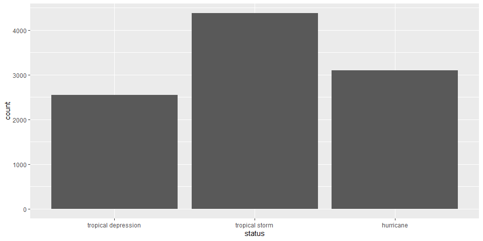
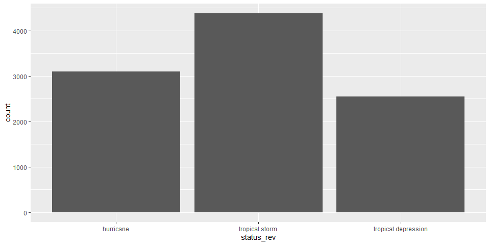
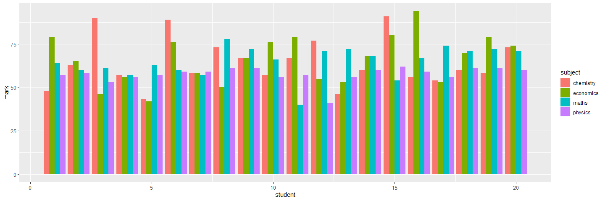

Tutorial 3 Reading in Data and Date/Strings
================
Tom Blackwood
23/11/2020

## Exercise 1 - Reading using `read_csv()` or `read_tsv()`

My files for this course are kept in a folder named `../intro_to_r/`.
The structure for where this markdown file is kept is in
`../intro_to_R/tutorials/tutorial */` and my data is held in
`../intro_to_R/data/`. The data used is supplied from the data bundle
available for the course.

``` r
csv_data <- read_csv("../../data/student_marks.csv")
```

    ## 
    ## -- Column specification --------------------------------------------------------
    ## cols(
    ##   student = col_double(),
    ##   maths = col_double(),
    ##   physics = col_double(),
    ##   chemistry = col_double(),
    ##   economics = col_double()
    ## )

``` r
head(csv_data)
```

    ## # A tibble: 6 x 5
    ##   student maths physics chemistry economics
    ##     <dbl> <dbl>   <dbl>     <dbl>     <dbl>
    ## 1       1    64      57        48        79
    ## 2       2    60      58        63        65
    ## 3       3    61      53        90        46
    ## 4       4    57      56        57        56
    ## 5       5    63      57        43        42
    ## 6       6    60      59        89        76

``` r
tsv_data <- read_tsv("../../data/nairn_raw.tsv")
```

    ## Warning: Missing column names filled in: 'X8' [8]

    ## 
    ## -- Column specification --------------------------------------------------------
    ## cols(
    ##   yyyy = col_double(),
    ##   mm = col_double(),
    ##   `tmax (degC)` = col_character(),
    ##   `tmin (degC)` = col_character(),
    ##   `af (days)` = col_character(),
    ##   `rain (mm)` = col_character(),
    ##   `sun (hours)` = col_character(),
    ##   X8 = col_character()
    ## )

``` r
head(tsv_data)
```

    ## # A tibble: 6 x 8
    ##    yyyy    mm `tmax (degC)` `tmin (degC)` `af (days)` `rain (mm)` `sun (hours)`
    ##   <dbl> <dbl> <chr>         <chr>         <chr>       <chr>       <chr>        
    ## 1  1931     1 5             0.6           11          78.4        43.4         
    ## 2  1931     2 6.7           0.7           7           48.9        63.6         
    ## 3  1931     3 6.2           -1.5          19          37.6        145.4        
    ## 4  1931     4 10.4          3.1           3           44.6        110.1        
    ## 5  1931     5 13.2          6.1           1           63.7        167.4        
    ## 6  1931     6 15.4          8             0           87.8        150.3        
    ## # ... with 1 more variable: X8 <chr>

## Exercise 2 - Writing using `write_csv()`

writing the storms data to a `.csv`

``` r
write_csv(storms, file="../../data/storms.csv")
```

## Exercise 3 - Converting `status` into `factor`

This exercise reads the data from `../data/storms.xlsx`, an excel file
in the data folder.

``` r
library(readxl)
library(forcats)
storms_xl <- read_xlsx("../../data/storms.xlsx")
storms_xl$status <- as_factor(storms_xl$status)
levels(storms_xl$status)
```

    ## [1] "tropical depression" "tropical storm"      "hurricane"

``` r
ggplot(storms_xl, aes(status)) +
  geom_bar()
```

<!-- -->

``` r
storms_xl$status_rev <- fct_rev(storms_xl$status)
ggplot(storms_xl, aes(status_rev)) +
  geom_bar()
```

<!-- -->

## Exercise 4 - Student marks `wide` to `long`

This exercise reads the data from `../data/student_marks.csv`, an excel
file in the data folder.

``` r
marks_wide <- read_csv("../../data/student_marks.csv")
```

    ## 
    ## -- Column specification --------------------------------------------------------
    ## cols(
    ##   student = col_double(),
    ##   maths = col_double(),
    ##   physics = col_double(),
    ##   chemistry = col_double(),
    ##   economics = col_double()
    ## )

``` r
marks_long <- pivot_longer(marks_wide, cols = maths:economics, names_to = "subject", values_to = "mark")
head(marks_long)
```

    ## # A tibble: 6 x 3
    ##   student subject    mark
    ##     <dbl> <chr>     <dbl>
    ## 1       1 maths        64
    ## 2       1 physics      57
    ## 3       1 chemistry    48
    ## 4       1 economics    79
    ## 5       2 maths        60
    ## 6       2 physics      58

``` r
ggplot(marks_long, aes(x = student, y = mark, fill = subject)) + 
  geom_col(position = "dodge")
```

<!-- -->

## Exercise 5 - Markdown vs Scripts

I have only really worked with creating the markdown documents, but I
have found that you can’t really run script sections in markdown unless
you have all the variables and libraries mentioned available in that
section, which might have been called earlier in the markdown file.
