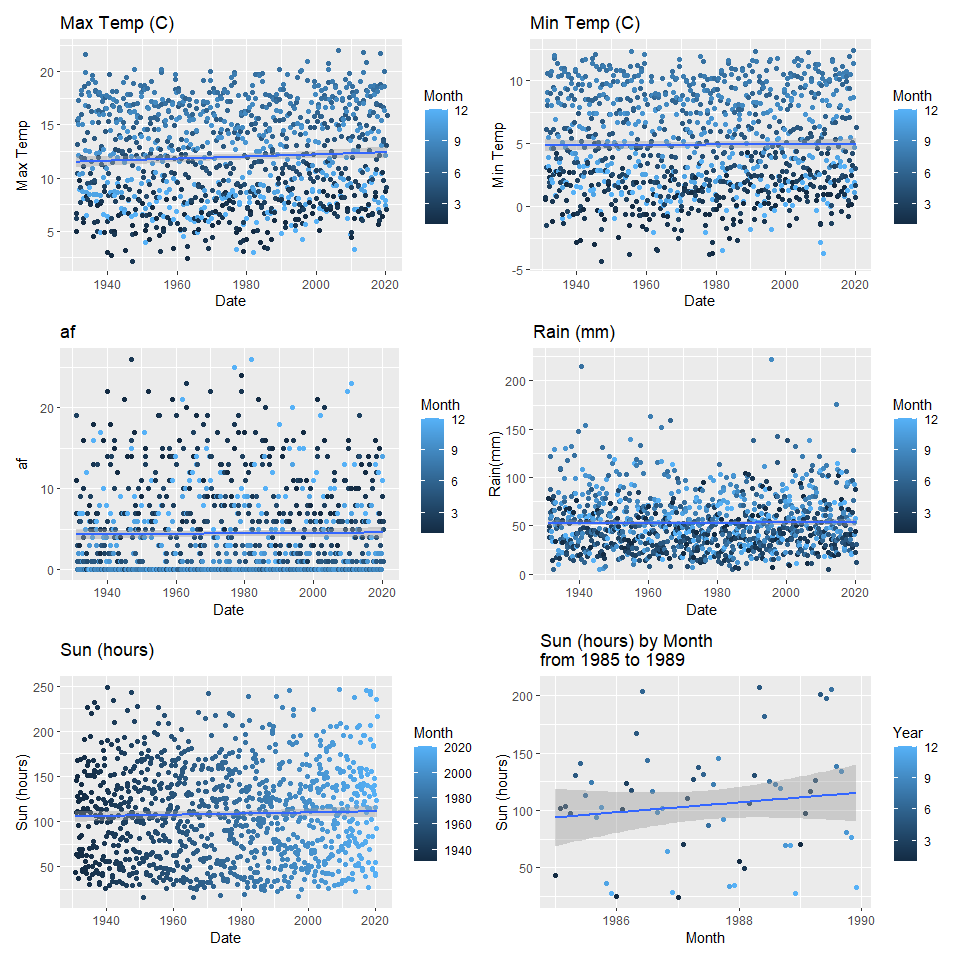

Tutorial 4 Dates and Strings
================
Tom Blackwood
23/11/2020

## Exercise 1 - Reading `nair_raw.tsv`

My files for this course are kept in a folder named `~/intro_to_r/`. The
structure for where this markdown file is kept is in
`~/intro_to_R/tutorials/tutorial */` and my data is held in
`~/intro_to_R/data/`. The data used is supplied from the data bundle
available for the course.

``` r
tsv_data <- read_tsv("../../data/nairn_raw.tsv")
head(tsv_data)
```

    ## # A tibble: 6 x 8
    ##    yyyy    mm `tmax (degC)` `tmin (degC)` `af (days)` `rain (mm)` `sun (hours)`
    ##   <dbl> <dbl> <chr>         <chr>         <chr>       <chr>       <chr>        
    ## 1  1931     1 5             0.6           11          78.4        43.4         
    ## 2  1931     2 6.7           0.7           7           48.9        63.6         
    ## 3  1931     3 6.2           -1.5          19          37.6        145.4        
    ## 4  1931     4 10.4          3.1           3           44.6        110.1        
    ## 5  1931     5 13.2          6.1           1           63.7        167.4        
    ## 6  1931     6 15.4          8             0           87.8        150.3        
    ## # ... with 1 more variable: X8 <chr>

``` r
summary(tsv_data)
```

    ##       yyyy            mm         tmax (degC)        tmin (degC)       
    ##  Min.   :1931   Min.   : 1.000   Length:1073        Length:1073       
    ##  1st Qu.:1953   1st Qu.: 3.000   Class :character   Class :character  
    ##  Median :1975   Median : 6.000   Mode  :character   Mode  :character  
    ##  Mean   :1975   Mean   : 6.484                                        
    ##  3rd Qu.:1998   3rd Qu.: 9.000                                        
    ##  Max.   :2020   Max.   :12.000                                        
    ##   af (days)          rain (mm)         sun (hours)             X8           
    ##  Length:1073        Length:1073        Length:1073        Length:1073       
    ##  Class :character   Class :character   Class :character   Class :character  
    ##  Mode  :character   Mode  :character   Mode  :character   Mode  :character  
    ##                                                                             
    ##                                                                             
    ## 

## Exercise 2 - Cleaning `nair_raw.tsv`

In the Head and the Summary, some columns that should be integers or
doubles are marked with `chr` implying they are characters or string
data instead.

``` r
tsv_data %>%
  group_by(`tmax (degC)`) %>%
  count()
```

    ## # A tibble: 245 x 2
    ## # Groups:   tmax (degC) [245]
    ##    `tmax (degC)`     n
    ##    <chr>         <int>
    ##  1 ---              18
    ##  2 10                7
    ##  3 10.1              7
    ##  4 10.1*             1
    ##  5 10.2              4
    ##  6 10.3              3
    ##  7 10.4             11
    ##  8 10.4*             2
    ##  9 10.5              6
    ## 10 10.5*             1
    ## # ... with 235 more rows

``` r
tsv_data %>%
  group_by(`tmin (degC)`) %>%
  count()
```

    ## # A tibble: 218 x 2
    ## # Groups:   tmin (degC) [218]
    ##    `tmin (degC)`     n
    ##    <chr>         <int>
    ##  1 ---              23
    ##  2 -0.1              5
    ##  3 -0.2              4
    ##  4 -0.3             10
    ##  5 -0.4              2
    ##  6 -0.4*             1
    ##  7 -0.5              6
    ##  8 -0.6             10
    ##  9 -0.7              4
    ## 10 -0.8              2
    ## # ... with 208 more rows

``` r
tsv_data %>%
  group_by(`af (days)`) %>%
  count()
```

    ## # A tibble: 45 x 2
    ## # Groups:   af (days) [45]
    ##    `af (days)`     n
    ##    <chr>       <int>
    ##  1 ---            14
    ##  2 0             406
    ##  3 0*             28
    ##  4 1              66
    ##  5 1*             11
    ##  6 10             21
    ##  7 10*             5
    ##  8 11             20
    ##  9 11*             3
    ## 10 12             15
    ## # ... with 35 more rows

``` r
tsv_data %>%
  group_by(`rain (mm)`) %>%
  count()
```

    ## # A tibble: 687 x 2
    ## # Groups:   rain (mm) [687]
    ##    `rain (mm)`     n
    ##    <chr>       <int>
    ##  1 ---             8
    ##  2 10.2            1
    ##  3 10.4            1
    ##  4 10.7            1
    ##  5 10.9            1
    ##  6 100             1
    ##  7 100.6           1
    ##  8 101             1
    ##  9 101.1           1
    ## 10 101.2           1
    ## # ... with 677 more rows

``` r
tsv_data %>%
  group_by(`sun (hours)`) %>%
  count()
```

    ## # A tibble: 834 x 2
    ## # Groups:   sun (hours) [834]
    ##    `sun (hours)`     n
    ##    <chr>         <int>
    ##  1 ---              24
    ##  2 100               2
    ##  3 100.2             3
    ##  4 100.4             2
    ##  5 100.5             2
    ##  6 100.6             1
    ##  7 100.7             1
    ##  8 101               2
    ##  9 101.2             1
    ## 10 101.4             1
    ## # ... with 824 more rows

Opening the file and having a look at the data, some entries are marked
with `---` implying missing data. Some data entries also have an
additional `*` attached to their value. The `---` values are going to be
replaced with `NULL` values because having `---` looks like an
unconventional `NULL` value, until localized averages are learned, and
the `*` will be removed from the entries before converting the whole
dataframe to a numeric using `as.numeric`.

While writing `"NULL"` as a string is probably bad practice, it is
interpreted as a `NULL` value in the dataframe, which will allow the
dataframe to be converted into a numeric without string or character
interference. Converting it to `0` might bias the the values for the
date.

``` r
tsv_data[tsv_data == "---"] <- "NULL"
tsv_data[] <- lapply(tsv_data, gsub, pattern = '\\*', replacement = '')
tsv_data[] <- sapply(tsv_data[], as.numeric)

head(tsv_data)
```

    ## # A tibble: 6 x 8
    ##    yyyy    mm `tmax (degC)` `tmin (degC)` `af (days)` `rain (mm)` `sun (hours)`
    ##   <dbl> <dbl>         <dbl>         <dbl>       <dbl>       <dbl>         <dbl>
    ## 1  1931     1           5             0.6          11        78.4          43.4
    ## 2  1931     2           6.7           0.7           7        48.9          63.6
    ## 3  1931     3           6.2          -1.5          19        37.6         145. 
    ## 4  1931     4          10.4           3.1           3        44.6         110. 
    ## 5  1931     5          13.2           6.1           1        63.7         167. 
    ## 6  1931     6          15.4           8             0        87.8         150. 
    ## # ... with 1 more variable: X8 <dbl>

``` r
summary(tsv_data)
```

    ##       yyyy            mm          tmax (degC)     tmin (degC)    
    ##  Min.   :1931   Min.   : 1.000   Min.   : 2.20   Min.   :-4.300  
    ##  1st Qu.:1953   1st Qu.: 3.000   1st Qu.: 8.10   1st Qu.: 1.800  
    ##  Median :1975   Median : 6.000   Median :11.80   Median : 4.500  
    ##  Mean   :1975   Mean   : 6.484   Mean   :11.95   Mean   : 4.901  
    ##  3rd Qu.:1998   3rd Qu.: 9.000   3rd Qu.:16.00   3rd Qu.: 8.500  
    ##  Max.   :2020   Max.   :12.000   Max.   :22.00   Max.   :12.400  
    ##                                  NA's   :18      NA's   :23      
    ##    af (days)        rain (mm)       sun (hours)          X8      
    ##  Min.   : 0.000   Min.   :  4.40   Min.   : 15.6   Min.   : NA   
    ##  1st Qu.: 0.000   1st Qu.: 32.00   1st Qu.: 63.6   1st Qu.: NA   
    ##  Median : 2.000   Median : 48.40   Median :106.9   Median : NA   
    ##  Mean   : 4.444   Mean   : 52.78   Mean   :108.1   Mean   :NaN   
    ##  3rd Qu.: 7.000   3rd Qu.: 68.20   3rd Qu.:143.4   3rd Qu.: NA   
    ##  Max.   :26.000   Max.   :222.40   Max.   :249.1   Max.   : NA   
    ##  NA's   :14       NA's   :8        NA's   :24      NA's   :1073

## Exercise 3 - Makin’ a `date`, oh yeah\!

Using `ymd()` from `lubridate` to create a date. Since the function
requires a day, and no specific day has been given, the day will be set
to `1`.

``` r
library(lubridate)

tsv_data$date <- ymd(str_c(tsv_data$yyyy, tsv_data$mm, "1", sep = "-"))
head(tsv_data$date)
```

    ## [1] "1931-01-01" "1931-02-01" "1931-03-01" "1931-04-01" "1931-05-01"
    ## [6] "1931-06-01"

## Exercise 4 - Plot it smooth, baby\!

In this exercise, `geom_smooth()` is used to create a trending line to
figure out if there is a relationship between `date` and the associated
column.

``` r
library(patchwork)

tmax_p <- ggplot(tsv_data, aes(x=date, y = `tmax (degC)`, colour=mm)) +
  geom_point() + 
  geom_smooth(method="lm") + 
  ggtitle("Max Temp (C)") + 
  labs(x="Date", y = "Max Temp", colour = "Month")

tmin_p <- ggplot(tsv_data, aes(x=date, y = `tmin (degC)`, colour=mm)) +
  geom_point() + 
  geom_smooth(method="lm") + 
  ggtitle("Min Temp (C)") + 
  labs(x="Date", y = "Min Temp", colour = "Month")

af_p <- ggplot(tsv_data, aes(x=date, y = `af (days)`, colour=mm)) +
  geom_point() + 
  geom_smooth(method="lm") + 
  ggtitle("af") + 
  labs(x="Date", y = "af", colour = "Month")  

rain_p <- ggplot(tsv_data, aes(x=date, y = `rain (mm)`, colour=mm)) +
  geom_point() + 
  geom_smooth(method="lm") + 
  ggtitle("Rain (mm)") + 
  labs(x="Date", y = "Rain(mm)", colour = "Month")

sun_p <- ggplot(tsv_data, aes(x=date, y = `sun (hours)`, colour=date)) +
  geom_point() + 
  geom_smooth(method="lm") + 
  ggtitle("Sun (hours)") + 
  labs(x="Date", y = "Sun (hours)", colour = "Month")

sun_p2 <- ggplot(filter(tsv_data, between(date, as.Date("1985-01-01"), as.Date("1989-12-31"))), aes(x=date, y = `sun (hours)`, colour=mm)) +
  geom_point() + 
  geom_smooth(method="lm") + 
  ggtitle("Sun (hours) by Month \nfrom 1985 to 1989") + 
  labs(x="Month", y = "Sun (hours)", colour = "Year")

(tmax_p + tmin_p) / (af_p + rain_p) / (sun_p + sun_p2)
```

<!-- -->
