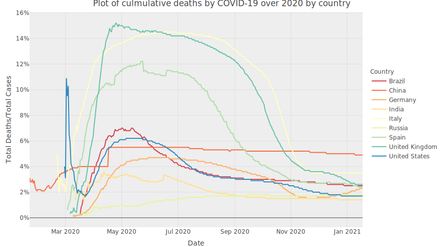
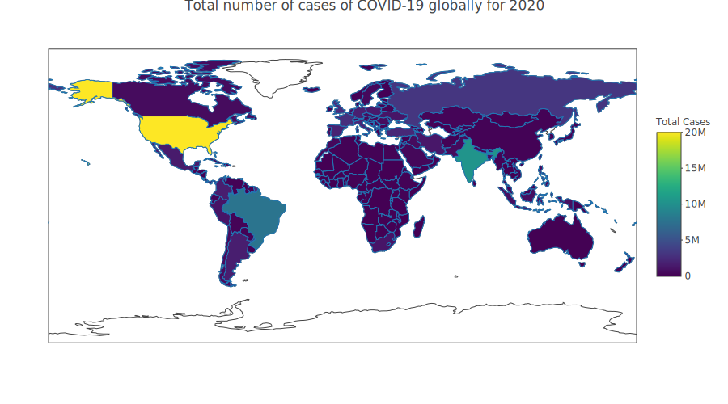
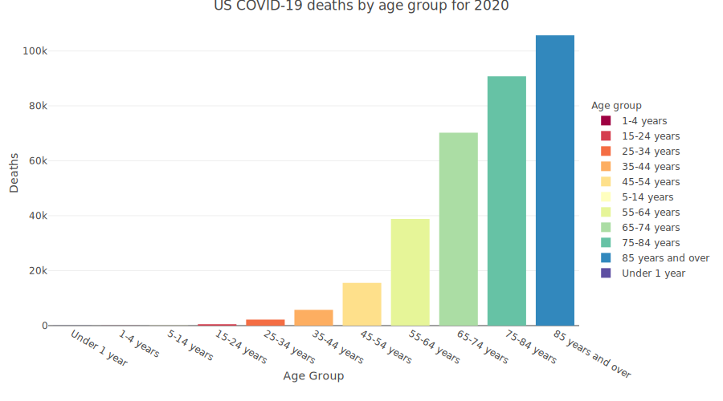

```{r setup, include=FALSE}
# For interactive html plots set to TRUE, doesn't work for .md
is_html = F

knitr::opts_chunk$set(echo = FALSE, # Print each bit of code or not
                      eval = TRUE, # Run each bit of code or not
                      comment = NA, # Prefix to data printed from code
                      message = FALSE, # Print messages
                      warning = FALSE, # Print warnings.
                      out.width = '100%',
                      out.height = '100%') 

library(dplyr)

library(ggplot2)

library(lubridate)

library(orca)

library(plotly)
library(purrr)

library(readxl)

library(stringr)

library(tidyverse)
```

```{r importing_data, echo=FALSE}

# Function to calculate the average occurring index value and then return the 
# associated string
average_age_group <- function(df){
  
  # Creating an index column to calculate the average age group with.
  df$df_index <- as.numeric(rownames(df))
  
  # Calculating the average age group of index by multiplying it by the total 
  # number of deaths at the same index. 
  # The returned average rounded value == average age group 
  df_mean_row <- round(sum(df$`COVID-19 Deaths` * df$df_index) / sum(df$`COVID-19 Deaths`))
  
  # Selecting the row of the average value calculated and selecting age group
  df <- df[df_mean_row,]
  
  # Selecting the age group column to return the value
  av_val <- select(df, `Age group`)
  
  # returning the average age group value
  return(av_val)
}

# ############## Global Data ##############

# Reading in the global data for COVID-19
global_covid <- read.csv("covid_data/owid-covid-data.csv")

# Data set is large, selecting columns to make df simple.
global_covid <- select(
                  global_covid,
                  date,
                  continent,
                  location,
                  iso_code,
                  total_cases,
                  new_cases,
                  total_deaths,
                  new_deaths
                )

global_covid["date"] <- mutate(global_covid, date = as.Date(global_covid$date, format = "%Y-%m-%d"))

# Making calculation of global deaths over cases as a measure of how effective 
# each country has managed the COVID-19. Lower score = Good!
global_covid$total_deaths_over_cases <- round(global_covid$total_deaths/global_covid$total_cases, 3)

# Filtering for last day of the year for total number of cases and multiply by 
# 100 to convert into percentage
glob_death_over_case <- select(
                          filter(
                            global_covid, 
                            date == "2020-12-31" & location == "World"
                          ), total_deaths_over_cases) * 100

us_death_over_cases <- select(
                          filter(
                            global_covid, 
                            date == "2020-12-31" & location == "United States"
                          ), total_deaths_over_cases) * 100

uk_death_over_cases <- select(
                          filter(
                            global_covid, 
                            date == "2020-12-31" & location == "United Kingdom"
                          ), total_deaths_over_cases) * 100


# ############## US Data ##############

# Importing US data
us_df <- read_csv("covid_data/Provisional_COVID-19_Death_Counts_by_Sex__Age__and_State.csv")

# US data has a mix of age groups so selecting particular age groups.
fil_age <- c(
            "Under 1 year", 
            "1-4 years", 
            "5-14 years", 
            "15-24 years", 
            "25-34 years", 
            "35-44 years", 
            "45-54 years", 
            "55-64 years", 
            "65-74 years", 
            "75-84 years",
            "85 years and over"
          )

# Filtering down the data to the specification below.
us_df_fil <- filter(
              us_df, 
              Sex == "All Sexes" & 
              State == "United States" & 
              `Age group` != "All Ages" &
              `Age group` %in% fil_age
              )

us_mean_death_grp <- average_age_group(us_df_fil)

# ############## UK Data ##############

# Reading in excel spread sheet: The age groups and associated deaths
xl_data <- read_excel("covid_data/Covid-19 Deaths England and Wales.xlsx", sheet = "Covid-19 - Weekly registrations", range = "B12:BC31")

# Data read in as matrix, transposing matrix to set up for making age groups as 
# column names and making as tibble.
e_and_w_data <- as.tibble(t(xl_data))
# Setting age groups as column names 
colnames(e_and_w_data) <- e_and_w_data[1,]
# Dropping the column name row but keeping the other data
e_and_w_data <- e_and_w_data[-1,]
# converting the data to numeric
e_and_w_data[] <- sapply(e_and_w_data[c(1:length(colnames(e_and_w_data)))], as.numeric)

# Reading in the date information  
xl_date <- read_excel("covid_data/Covid-19 Deaths England and Wales.xlsx", sheet = "Weekly figures 2020", range = "C5:BC6")
# Transposing the matrix
xl_date <- t(xl_date)
# Setting the column name as Date
colnames(xl_date) <- "Date"
# Stating it's a tibble
xl_date <- as.tibble(xl_date)
# Converting it to date format
xl_date <- mutate(xl_date, Date = as.Date(xl_date$Date, format = "%Y-%m-%d"))

# setting rownames of the data to match that of the date
rownames(e_and_w_data) <- rownames(xl_date)

# Setting the data in a new data frame to prepare it for having the date added
e_and_w_df <- e_and_w_data
# Adding the date
e_and_w_df$Date <- xl_date$Date

# Sorting the columns to have the date at the front
e_and_w_df <- select(e_and_w_df, Date, colnames(e_and_w_data))

# Creating a sum of deaths over the year for each age group (by column)
e_and_w_df_plot_2 <- as.tibble(t(colSums(e_and_w_data)))

# Pivoting the table to have a column dedicated to age group and a column for
# deaths
e_and_w_df_plot_2 <- pivot_longer(
                            e_and_w_df_plot_2,
                            cols = colnames(e_and_w_df_plot_2),
                            names_to = "Age group",
                            values_to = "COVID-19 Deaths"
                           )

# Calculating the average age of death like with England and Wales data. 
e_and_w_mean_death_grp <- average_age_group(e_and_w_df_plot_2)

# ############## Scotland Data ##############
# Function for mapping in the list of csv files
get_scot_df <- function(l_item){
  # First read in to find the age group for this file
  age_tmp <- read_csv(l_item)
  # Find the age group based on finding the row with the string "Age" and then 
  # getting the next column's value
  age_grp <- age_tmp[str_detect(age_tmp$`Generated by http://statistics.gov.scot`, "Age"),2]
  # Setting the value to "Age Group for reasons...
  names(age_grp) <- "Age group" 
  # Dropping any NA values... for reasons...
  age_grp <- drop_na(age_grp)
  
  # Data frame can not be read straight in because a row of 'white space' exists 
  # which cuts off data. Skipping to row 9 allows data to be read.
  df <- read_csv(l_item, skip_empty_rows = FALSE, skip = 9)
  # Two unnecessary rows are picked up, and dropped.
  df <- select(df, -X1, -X2)
  # Setting the first row as the column names
  colnames(df) <- df[1,]
  # Dropping the sum values of 2020 and 2021 
  df <- select(df, -`2020`, -`2021`)
  # Dropping the row that was just made into column headers 
  df <- df[2,]
  # Pivoting the data frame to create a date column and an "age group deaths" 
  # column titled with the age grabbed from the first "read_csv()"
  df <- pivot_longer(
                  df, 
                  cols = colnames(df), 
                  names_to = "Date", 
                  values_to= age_grp$`Age group`
                )
  # Creating a date series to clean
  df_date <- df$Date
  # Removing the string pattern that appears in the series
  df_date <- str_remove(df_date, pattern = "w/c ")
  # Declaring the cleaned date as a date and returning it to the date column
  df$Date <- as.Date(df_date, format = "%Y-%m-%d")
  # Returning the read in data frame to the list
  return(df)
}

# Defining a pattern for the "list.files()" to spot
scot_pattern <- "deaths-involving-coronavirus-covid-19_[0-9]"
# Getting a list of files with the above pattern
scot_path <- list.files(path = "covid_data/", pattern = scot_pattern)
# Concating the filepaths to the files
scot_path <- str_c("covid_data/", scot_path)
# Mapping in the data via the filepaths to a list
scot_data <- map(scot_path, get_scot_df)
# joining the list by the date column
scot_data <- scot_data %>% reduce(inner_join, by= "Date")

# Getting a list of age groups from the column headers
age_groups <- colnames(select(scot_data, -Date))

# Making the data numeric 
scot_data[age_groups] <- sapply(scot_data[age_groups], as.numeric)

# Getting a sum of the age groups, transposing the data and converting to tibble
# for plotting
scot_df_plot_2 <- as.tibble(t(colSums(scot_data[age_groups])))
# Pivoting the data to prepare it for a barplot and to enter it into the
# average_age_group function
scot_df_plot_2 <- pivot_longer(
                            scot_df_plot_2,
                            cols = age_groups,
                            names_to = "Age group",
                            values_to = "COVID-19 Deaths"
                           )

scot_mean_death_grp <- average_age_group(scot_df_plot_2)

```
### Main findings

* Over 2020 `r glob_death_over_case`% of all COVID-19 cases in the world have resulted in death.
* The average age group for deaths by COVID-19 in the US is `r us_mean_death_grp`, and `r us_death_over_cases`% of cases result in death. 
* The average age group for deaths by COVID-19 in England and Wales is `r e_and_w_mean_death_grp` years, and `r uk_death_over_cases`% of cases result in death.
* The average age group for deaths by COVID-19 in the Scotland is `r scot_mean_death_grp`.

## Introduction

This is a report looking to investigate the ages of death in the coronavirus pandemic of 2020. This report will also look at total deaths and compare that to deaths by similar diseases in previous years to offer a comparison between the COVID-19 deaths and deaths by other diseases.

The inspiration for this study comes from a study performed by Dr Jason Oke where he found that the average age of deceased COVID-19 patients was about 79.5 years where the median was 80.5 and the range from 31 to 103. [@oke2020global] Starting from that study, this essay will investigate where the average age lies with other age groups in the US, UK, and also in Scotland.

But before looking into ages of death, this study will look at the global cases and deaths and a value of deaths/cases or the percentage of cases that resulted in death. 

### Global analysis of COVID-19

A data set for COVID-19 was obtained online from Our World in Data. [@GlobCovid19] The number of cases and number of deaths has been plotted below to give a perspective of how the number of cases has compared to the number of deaths.

For this plot a select few countries were chosen because too many sources makes the plot too noisy. The selected countries are: United States, United Kingdom, Germany, Spain, Russia, China, India, Brazil. The US, Brazil, and India were chose as they seem to have rampant numbers of cases however in the death/case rate is lower than the UK. 

```{r world_case_vs_death_data, echo=FALSE}

# Stating which countries the initial line plots will look at.
loc_to_plot <- c("United Kingdom",
                 "Germany",
                 "Russia",
                 "Spain",
                 "India",
                 "Brazil",
                 "United States",
                 "China",
                 "Italy"
                 )

# Filter for only the select countries
global_covid_fil <- filter(global_covid, location %in% loc_to_plot)

# Plot the Cases and the Deaths with respect to date.
p1 <- plot_ly(
    # Data set
    global_covid_fil,
    # State the x value from data set, will plot out as time series
    x = ~date,
    # state the y value from data set 
    y = ~total_cases,
    # State the colouring of chart is based on location
    color = ~location,
    # Set the colour scheme of the lines
    colors = "Spectral",
    # Select the chart type
    type = "scatter",
    # Specify lines
    mode = "lines"
  ) %>%
  layout(
    # Set the X and Y axis names
    xaxis = list(title = "Date"),
    yaxis = list(title = "Culmulative cases")
  )

p2 <- plot_ly(
    global_covid_fil,
    x = ~date,
    y = ~total_deaths,
    color = ~location,
    colors = "Spectral",
    line = list(dash = 'dash'),
    type = "scatter",
    mode = "lines"
  ) %>%
  layout(
    # Title plots
    title = "Culmulative cases and deaths by COVID-19 by country",
    xaxis = list(title = "Date"),
    yaxis = list(title = "Culmulative deaths"),
    legend = list(title = list(text='Country')),
    plot_bgcolor = "#eee",
    # set width of plots
    width = 900
  )
# Plot and show X and Y axis titles. Plot in 1 column.
psub <- subplot(p1, p2, titleY = TRUE, titleX=TRUE, nrows = 2) 

if (is_html){
  psub
} else {
  orca(psub, "figs/world_case_vs_death_data.svg")
# It was proposed to export the images from plotly so they could be used as 
# figures for the markdown however automating this would require another package
# https://plotly-r.com/exporting-static-images.html
  knitr::include_graphics("figs/world_case_vs_death_data.svg")
}
```
     
The number of cases for each country has been divided by the number of deaths to give a death/case percentage or a measure of how many cases resulted in deaths. Ideally for a country successfully treating the virus the ratio will be low, close to zero. The purpose of this is to have a measure of how dangerous the virus is. If 100% of COVID-19 cases in death, then the virus should be considered as concerning. However if a small percentage of cases result in deaths, then a question should be asked of *"Should the virus be considered as concerning?"* 

```{r world_case_ov_death_plt}
# Plot the deaths over cases
p <- plot_ly(
  global_covid_fil,
  x = ~date,
  y = ~total_deaths_over_cases,
  color = ~location,
  colors = "Spectral",
  type = "scatter",
  mode = "lines"
) %>%
layout(
  title = "Plot of culmulative deaths by COVID-19 over 2020 by country",
  xaxis = list(title = "Date"),
  yaxis = list(title = "Total Deaths/Total Cases", tickformat = ',.0%'),
  legend = list(title = list(text='Country'), y = 0.75),
  plot_bgcolor = "#eee",
  width = 900
)

if (is_html){
  p
} else {
  orca(p, "figs/world_case_ov_death_plt.svg")
  
}

```
What these plots show is the United States has the greatest increase in coronavirus cases, followed by Brazil which is overtaken by India in September. The number of deaths is difficult to read with respect to number of cases so a ratio of cases over deaths is calculated.

What the deaths over cases curves show is that of the selected locations the number of deaths vs cases peaks and then tails off at the end of October. What's interesting to see is that although the US has a very high number of cases and number of death, their ratio is not as great as Spain or the United Kingdom. Russia appears to have the lowest ratio followed by India and Germany. China has an unusual step in their values in the middle of April and then stays constant, and looking at the raw data it would be because China doesn't report many new deaths after the 15th of April. 

Looking at the total number of cases across the globe for 2020 a choropleth can be plotted to show where the hot spots of COVID-19 have occurred. Some of the countries appear to report a very low value for COVID-19 and this may be due to lack of testing facilities. 

It should be noted that no data is available for cases for Greenland.

```{r glob_cases, echo=FALSE}
global_covid_chor <- drop_na(global_covid, total_cases)

# $location has a value of "World" which is the sum of the other locations. It 
# skews the colorbar into larger values that dwarfs the actual location values.
global_covid_chor <- filter(global_covid_chor, date == "2020-12-31" & location != "World")


p <- plot_ly(
  # Plot data
  global_covid_chor,
  # Stating graph type: choropleth
  type='choropleth',
  # Using ISO codes for location data
  locations= ~iso_code,
  # Setting colour scheme to shade based on total cases
  z=~total_cases,
  # Set the colour scheme of the lines
  colorscale = "Viridis",
  # Setting colour bar
  colorbar = list(title = "Total Cases", yanchor = "middle")
) %>%
layout(
  title = "Total number of cases of COVID-19 globally for 2020",
  # Set the colour scheme of the lines
  coloraxis = list(colorscale = "hot"),
  width = 900
)

if (is_html){
  p
} else {
  orca(p, "figs/world_choro_cases_plt.svg")
  
}

p <- plot_ly(
  global_covid_chor,
  type='choropleth',
  locations= ~iso_code,
  z=~total_deaths,
  # Set the colour scheme of the lines
  colorscale = "Viridis",
  colorbar = list(title = "Total Deaths", yanchor = "middle")
) %>%
layout(
  title = "Total number of deaths by COVID-19 globally for 2020",
  # Set the colour scheme of the lines
  coloraxis = list(colorscale = "hot"),
  width = 900
)

if (is_html){
  p
} else {
  orca(p, "figs/world_choro_death_plt.svg")
  knitr::include_graphics("figs/world_choro_death_plt.svg")
}

max_death_loc <- global_covid_chor[which.max(global_covid_chor$total_deaths_over_cases),]
```

And interestingly the country that has suffered COVID-19 the longest seems to be one of the countries with the least number of cases and least number of deaths.

```{r glob_deaths_over_cases, echo=FALSE}
p <- plot_ly(
  global_covid_chor,
  type='choropleth',
  locations= ~iso_code,
  z=~total_deaths_over_cases,
  # Set the colour scheme of the lines
  colorscale = "Viridis",
  zmin = 0,
  zmax = 1,
  colorbar = list(title = "Total Deaths/Cases", yanchor = "middle", tickformat = ',.0%')
) %>%
layout(
  title = "Total deaths / cases of COVID-19 globally for 2020",
  legend = list(title = list(text='Country')),
  width = 900
)

if (is_html){
  p
} else {
  orca(p, "figs/glob_deaths_over_cases.svg")
  knitr::include_graphics("figs/glob_deaths_over_cases.svg")
}
```
Plotting deaths divided by cases shows the probability of what percentage are expected to die with respect to cases, and interestingly `r max_death_loc$location` seems to suffer the greatest number of deaths to case ratio at `r max_death_loc$total_deaths_over_cases * 100`%. And looking into the data of `r max_death_loc$location`, the number of deaths they see is `r max_death_loc$total_deaths` with respect to `r max_death_loc$total_cases` cases. 

### US analysis of deaths vs age

The CDC published figures per state looking at age groups and deaths due to COVID-19 [@UsCovid19]. The data consists of two formats of age grouping - "under 1 year, 1-4 years, 5-14 years,..." and "0-17 years, 18-29 years, ..." and the second set was filtered out. Additionally the data also held information on the sexes and individual states however this essay looks at both sexes and the deaths across the united states. The data also includes `Pneumonia Deaths`, `Pneumonia and COVID-19 deaths`, `Influenza Deaths`, and `Pneumonia, Influenza or COVID-19 Deaths`.

```{r us_age_death}

p <- plot_ly(
  us_df_fil,
  x = ~`Age group`,
  y = ~`COVID-19 Deaths`,
  color = ~`Age group`,
  colors = "Spectral",
  type = "bar",
  mode = "unstack"
) %>%
layout(
  title = "US COVID-19 deaths by age group for 2020",
  xaxis = list(
            title = "Age Group", 
            categoryorder = "array", 
            categoryarray = us_df_fil$`Age group`
          ),
  yaxis = list(title = "Deaths"),
  legend = list(title = list(text='Age group'), y = 0.75),
  width = 900
)

if (is_html){
  p
} else {
  orca(p, "figs/us_age_death.svg")
  
}
```

The age groups are a string integer which is difficult to find the average value by. The average occurring index value will be looked at instead and then rounded to an integer. The average occurring index value will then be considered as the average occurring age group for mortality by COVID-19. By setting the index to a column and multiplying each index by the count of `COVID-19 Deaths` and dividing by the total sum of the `COVID-19 Deaths`, the average row number value occurring can be found, and this row value can be referenced into the data to pull out the average age group for for deaths. 

What is found is that the age group of `r us_mean_death_grp` is where the average number of deaths lay.

From the US data set, the COVID-19 data compared to other causes of death, particularly pneumonia.

```{r us_age_death_mix}
us_df_plt_2 <- pivot_longer(us_df_fil, 
                            cols = c(
                              `COVID-19 Deaths`, 
                              `Pneumonia Deaths`, 
                              `Pneumonia and COVID-19 Deaths`, 
                              `Influenza Deaths`
                              ),
                            names_to = "Cause",
                            values_to = "cause_val")

p <- plot_ly(
  us_df_plt_2,
  x = ~`Age group`,
  y = ~cause_val,
  color = ~Cause,
  colors = "Spectral",
  type = "bar",
  mode = "unstack"
) %>%
layout(
  title = "US deaths by cardiovascular diseases and age group for 2020",
  xaxis = list(
            title = "Age Group", 
            categoryorder = "array", 
            categoryarray = us_df_fil$`COVID-19 Deaths`
          ),
  yaxis = list(title = "Deaths"),
  legend=list(orientation = 'h', y = -0.3),
  width = 900
)

if (is_html){
  p
} else {
  orca(p, "figs/us_age_death_mix.svg")
  knitr::include_graphics("figs/us_age_death_mix.svg")
}
```

### England and Wales analysis of deaths vs age

Now looking at the United Kingdom, the United Kingdom government has published data of coronavirus *related* deaths with respect to age [@UkCovid19]. In the data sets the deaths recorded are as *involving COVID-19*. The issue with this nomenclature is that the 2019 coronavirus was recorded in the death certificate as a contributing factor but it may not have been the actual cause. This has the issue of obfuscating the clarity of the reason of death and putting undue alarm where the natural end of nature occurs. 

The data from the national office of statistics was presented in an excel spreadsheet which makes the data very tidy but hard to navigate when importing without a bit of cleaning taking place. 

For instance two slices of cells are sampled from a sheet. The first slice holds the row names of age group and the associated data in that row of deaths with respect to the date in the year. The second slice is of the dates themselves as column names. The table is imported as a matrix, transposed to have the 'row names' as column names, and converted into a tibble. The 'row names' are not an index value so that row of elements can be used to name the `colnames()` and then that row is removed from the data frame. The dates were also imported as a data frame but the dates themselves are imported as an excel `date-number`. `read_excel()` recognizes and automatically converts these numbers to a `date` type.

```{r e_and_w_age_death_by_date}

# xlsx_data <- "covid_data/Covid-19 Deaths England and Wales.xlsx"
# sheet_names <- excel_sheets(path = xlsx_data)
# excel_sheets <- lapply(sheet_names , function(x) read_excel(path = xlsx_data, sheet = x))

# Setting up tibble for plotting
e_and_w_df_plot <- tibble()
e_and_w_df_plot <- pivot_longer(
                e_and_w_df,
                cols = colnames(e_and_w_data),
                names_to = "Age group",
                values_to = "death_vals"
              )
e_and_w_df_plot$`Age group` <- factor(
                e_and_w_df_plot$`Age group`,
                levels = colnames(e_and_w_data)
              )
p <- plot_ly(
  e_and_w_df_plot,
  x = ~Date,
  y = ~death_vals,
  color = ~`Age group`,
  colors = "Spectral",
  type = "scatter",
  mode = "line"
) %>%
layout(
  title = "England and Wales COVID-19 deaths by age group for 2020",
  xaxis = list(title = "Date"),
  yaxis = list(title = "Deaths"),
  legend = list(title = list(text='Age group')),
  width = 900
)

if (is_html){
  p
} else {
  orca(p, "figs/e_and_w_age_death_by_date.svg")
  
}
```

The date was then added to the data set to give the values of number of deaths by date, and summed to give total deaths for each age group.

```{r e_and_w_age_death}
factor_levels <- c("1-4", "5-9", "10-14", "15-19", "20-24", "25-29", "30-34", 
                   "35-39", "40-44", "45-49", "50-54", "55-59", "60-64", 
                   "65-69", "70-74", "75-79", "80-84", "85-89", "90+")

e_and_w_df_plot_2$`Age group` = factor(e_and_w_df_plot_2$`Age group`, levels = factor_levels)

p <- plot_ly(
  e_and_w_df_plot_2,
  x = ~`Age group`,
  y = ~`COVID-19 Deaths`,
  color = ~`Age group`,
  colors = "Spectral",
  type = "bar",
  mode = "unstack"
) %>%
layout(
  title = "England and Wales COVID-19 deaths by age group for 2020",
  xaxis = list(
            title = "Age Group (years)",
            categoryorder = "array",
            categoryarray = e_and_w_df_plot_2$`Age group`,
            tickangle = 45
          ),
  yaxis = list(title = "Deaths"),
  legend = list(
            title = list(text='Age group')
          ),
  coloraxis = list(
            categoryorder = "array",
            categoryarray = e_and_w_df_plot_2$`Age group`
          ),
  width = 900
) 

if (is_html){
  p
} else {
  orca(p, "figs/e_and_w_age_death.svg")
  
}
```

What is found is that the age group of `r e_and_w_mean_death_grp` is where the average number of deaths lay.

The leading causes of death from 2001 to 2018 across the UK can also be obtained from the Office of National Statistics [@UkLeadDeaths]. The causes available are featured in the table below. 

```{r table_of_causes}
# Reading in excel spread sheet: The age groups and associated deaths
xlsx_data <- "covid_data/All_deaths.xlsx"
sheet_names <- excel_sheets(path = xlsx_data)
excel_sheets <- lapply(sheet_names , function(x) read_excel(path = xlsx_data, sheet = x))
uk_deaths_df <- excel_sheets[[14]]
causes <- unique(uk_deaths_df$Cause)
knitr::kable(causes, col.names = "Cause of Death", caption = "Table 1: List of leading causes of death from 2001 - 2018")
```

The values that are recognized as most relevant to the COVID-19 disease are `Acute respiratory infections other than Influenza and pneumonia (J09-J18) (J00-J06)`, `Influenza and pneumonia (J09-J18)`, `Malignant neoplasm of trachea, bronchus and lung (C33-C34)`, `Chronic lower respiratory diseases (J40-J47)`, and `Systemic atrophies primarily affecting the central nervous system`.


```{r uk_other_deaths, fig.height = 10, fig.width = 7.5}
# Cause values perceived as most relevant/similar to COVID-19 
leading_cvd_causes <- c(
        "Acute respiratory infections other than Influenza and pneumonia (J09-J18) (J00-J06)",
        "Influenza and pneumonia (J09-J18)",
        "Malignant neoplasm of trachea, bronchus and lung (C33-C34)",
        "Chronic lower respiratory diseases (J40-J47)",
        "Systemic atrophies primarily affecting the central nervous system"
      )

uk_deaths_df <- filter(uk_deaths_df, `Age group` != "All Ages" & Cause %in% leading_cvd_causes & Sex %in% c("Male", "Female"))

x_axis_format <- c("1-4 Years", "5-19 Years", "20-34 Years", "35-49 Years", "50-64 Years", "65-79 Years", "80+ Years")
uk_deaths_df$`Age group` <- factor(uk_deaths_df$`Age group`, levels = x_axis_format)

plot_deaths <- function(dat){
  if (dat$Year == 2001){
    plot_ly(dat) %>%
      add_bars(x = ~`Age group`, y = ~Deaths, color = ~Cause, colors = "Spectral", mode = "unstack", legendgroup = ~Cause) %>%
      # add_text(text = ~unique(Year)) %>%
      layout(
        xaxis = list(
                  title = "Age Group",
                  tickangle = 45
                ),
        yaxis = list(title = "Deaths"),
        annotations = list(
         list(text = ~unique(Year),
              x = 0.5,
              y = 1,
              xref = 'paper',
              yref = 'paper',
              xanchor = "middle",
              yanchor = "top",
              showarrow = F,
              font = list(size = 15))
        ),
        legend = list(orientation = 'h'),
        plot_bgcolor = "#eee"
      )
  } else {
    plot_ly(dat) %>%
      add_bars(x = ~`Age group`, y = ~Deaths, color = ~Cause, colors = "Spectral", mode = "unstack", legendgroup = ~Cause, showlegend = F) %>%
      layout(
        xaxis = list(
                  title = "Age Group",
                  tickangle = 45
                ),
        yaxis = list(title = "Deaths"),
        annotations = list(
         list(text = ~unique(Year),
              x = 0.5,
              y = 1.05,
              xref = 'paper',
              yref = 'paper',
              xanchor = "middle",
              yanchor = "top",
              showarrow = F,
              font = list(size = 15))
        ),
        plot_bgcolor = "#eee"
      )  
  }
}

uk_deaths_df <- uk_deaths_df %>% group_by(Year)
uk_deaths_plt <- uk_deaths_df %>% do(mafig = plot_deaths(.))
p <- uk_deaths_plt %>% subplot(nrows = 6, shareY = TRUE, shareX = TRUE, titleY = TRUE, titleX = TRUE)
p <- p %>%
    layout(
      title = "UK deaths by cardiovascular diseases and age group from 2001 to 2018",
      height = 1000,
      width = 900
    )

if (is_html){
  p
} else {
  orca(p, "figs/uk_other_deaths.svg")
  
}

# pgg <- uk_deaths_df %>% 
#   ggplot(aes(x = `Age group`, y = Deaths, fill = Cause)) + 
#   geom_col(position = "dodge", width = 0.5) +
#   theme(
#     legend.text = element_text(size = 8),
#     legend.title = element_text(size = 10),
#     legend.position = "none",
#     axis.text.x = element_text(angle = 45, hjust = 1)
#   ) + 
#   facet_wrap(~Year, ncol = 3) + 
#   ggtitle("UK deaths by cardiovascular diseases and age group from 2001 to 2018") + 
#   labs(x = "Age Group", y = "Deaths", fill = "Cause")
# 
# pgg + 
#   theme(legend.position = "bottom") + 
#   guides(fill = guide_legend(ncol = 1))
```

Comparatively speaking with respect to COVID-19 deaths, the number of deaths seen by other causes of similar standing is similar and the next question asked should be *How have deaths relating to these other diseases and disorders been impacted by COVID-19?*  

From the plot above the most vulnerable groups from the selected illnesses are `50-64 Years`, `65-79 Years`, and `80+ Years`. The associated causes are `Chronic lower respiratory diseases (J40-J47)`, `Influenza and pneumonia (J09-J18)`, and `Malignant neoplasm of trachea, bronchus and lung (C33-C34)`. The other features of `Acute respiratory infections other than Influenza and pneumonia (J09-J18) (J00-J06)` and `System atrophies primarily affecting the central nervous system` affect only the age group `1-4 Years` in comparably insignificant values. `Influenza and pneumonia (J09-J1)` does have deaths in other age groups but the number of deaths below the age of 65 is around 50 total per year.

```{r uk_case_compare}

age_groups_gen <- c("50-64 Years", "65-79 Years", "80+ Years")

uk_compare_deaths_df <- filter(excel_sheets[[14]], `Age group` %in% age_groups_gen & Cause %in% leading_cvd_causes)

uk_compare_deaths_df <- pivot_wider(uk_compare_deaths_df, names_from = Sex, values_from = Deaths)
uk_compare_deaths_df$Deaths <- uk_compare_deaths_df$Male + uk_compare_deaths_df$Female

uk_compare_deaths_df$Date <- ymd(str_c(uk_compare_deaths_df$Year, 1, 1, sep = "-"))

plot_deaths_2 <- function(dat){
  if (dat$Cause == "Chronic lower respiratory diseases (J40-J47)"){
    plot_ly(dat) %>%
      add_bars(x = ~year(Date), y = ~Deaths, color = ~`Age group`, colors = "Spectral", mode = "unstack", legendgroup = ~`Age group`) %>%
      layout(
        xaxis = list(
                  title = "Age Group",
                  tickangle = 45
                ),
        yaxis = list(title = "Deaths"),
        annotations = list(
         list(text = ~unique(Cause),
              x = 0.5,
              y = 1,
              xref = 'paper',
              yref = 'paper',
              xanchor = "middle",
              yanchor = "top",
              showarrow = F,
              font = list(size = 15))
        ),
        legend = list(orientation = 'h'),
        plot_bgcolor = "#eee"
      )
  } else {
    plot_ly(dat) %>%
      add_bars(x = ~year(Date), y = ~Deaths, color = ~`Age group`, colors = "Spectral", mode = "unstack", legendgroup = ~`Age group`, showlegend = F) %>%
      layout(
        xaxis = list(
                  title = "Age Group",
                  tickangle = 45
                ),
        yaxis = list(title = "Deaths"),
        annotations = list(
         list(text = ~unique(Cause),
              x = 0.5,
              y = 1,
              xref = 'paper',
              yref = 'paper',
              xanchor = "middle",
              yanchor = "top",
              showarrow = F,
              font = list(size = 15))
        ),
        legend = list(orientation = 'h'),
        plot_bgcolor = "#eee"
      )
  }
}

uk_compare_deaths_df <- uk_compare_deaths_df %>% group_by(Cause)
uk_compare_deaths_plt <- uk_compare_deaths_df %>% do(mafig = plot_deaths_2(.))
p <- uk_compare_deaths_plt %>% subplot(nrows = 3, shareY = TRUE, shareX = TRUE, titleY = TRUE, titleX = TRUE)
p <- p %>%
    layout(
      title = "UK deaths by cardiovascular diseases and age group from 2001 to 2018",
      height = 1000,
      width = 900
    )

if (is_html){
  p
} else {
  orca(p, "figs/uk_case_compare.svg")
  
}

```


### Scotland analysis of deaths vs age

The Scottish COVID-19 data can be obtained from the National Records of Scotland. [@ScotCovid19] This data set has been quite difficult to work with. The `.csv` files had to be downloaded individually for each age group. A list of filenames looking for a pattern has to be generated and then the list is mapped to a `read_csv()` function not just once but twice. The data inside the `.csv` has a bit of information about the data inside the `.csv` but after this is a blank row which the `read_csv()` function considers as the end of file. The second `read_csv()` function run is set to skip down to where the data begins again so that those rows may be read in. The first `read_csv()` pulls  the data detail of age group which will be used for the column header to the main data.

The main data was read in by skipping a few rows. Then the first two columns had to be dropped and the colnames were set to the date which was on the first row of data. Two values of the annual totals are included at the end of the data set which were not required so they were dropped as columns after the `colnames()` were set. `pivot_longer()` was used to orientate the data from being in a wide date to having a column of dates and an associated column of deaths, setting the deaths column name to the age group from the first `read_csv()`. The date column had an additional string of `"w/c "` so the `str_remove()` was used to remove the pattern from the date column. It was then convert the date into a `Date` type. This small data frame was then returned to the list that was being mapped in. After the mapping, the `reduce()` function was run to join the lists by an `inner_join()` using the `Date` column.

And now the data set is as a data frame and can be plotted.

```{r scot_death_over_year}
scot_df_plot <- pivot_longer(
                scot_data,
                cols = age_groups,
                names_to = "Age group",
                values_to = "death_vals"
              )

scot_df_plot$`Age group` <- factor(
                scot_df_plot$`Age group`,
                levels = age_groups
              )


p <- plot_ly(
  scot_df_plot,
  x = ~Date,
  y = ~death_vals,
  color = ~`Age group`,
  colors = "Spectral",
  type = "scatter",
  mode = "line"
) %>%
layout(
  title = "Scotland COVID-19 deaths by age group over 2020",
  xaxis = list(title = "Date"),
  yaxis = list(title = "Deaths"),
  colorbar = list(title = "COVID-19 Deaths", yanchor = "middle"),
  legend = list(title = list(text='Age group'), y = 0.75),
  width = 900
)

if (is_html){
  p
} else {
  orca(p, "figs/scot_death_over_year.svg")
  knitr::include_graphics("figs/scot_death_over_year.svg")
}
```

And the total deaths for each age group for COVID-19 in 2020 is plotted below.
```{r scot_age_death}
p <- plot_ly(
  scot_df_plot_2,
  x = ~`Age group`,
  y = ~`COVID-19 Deaths`,
  color = ~`Age group`,
  colors = "Spectral",
  type = "bar",
  mode = "unstack"
) %>%
layout(
  title = "Scotland COVID-19 deaths by age group for 2020",
  xaxis = list(title = "Age Group"),
  yaxis = list(title = "Deaths"),
  legend = list(title = list(text='Age group'), y = 0.75),
  width = 900
)

if (is_html){
  p
} else {
  orca(p, "figs/scot_age_death.svg")
  knitr::include_graphics("figs/scot_age_death.svg")
}
```

And again the mean occurrence of where the deaths occur in COVID-19 by age group is `r scot_mean_death_grp`.

## Conclusions

This has been a bit of a gradient in working with data sets. The Global data set was easy to work with and well laid out, the `.csv` was a bit large with extra details, and it didn't have age specific details in it but some plots could be made with it. The US data set was the samilarly easy to work with, there were age groups included with the data which were superfluous to this essay's needs. The UK Office of National Statistics excel spreadsheet was initially difficult to read in as a sheet had to be stated and a portion of cells extracted. The data had to be manipulated and molded into a `tibble()` with a date column. The sheets may be trimmed down in order to package the project for submission. The scottish data was the most difficult as it was held in different `.csv`s and a row of white space prevented the files from being read in properly. Thankfully the data was presented in the file in a uniform manner so a function could be written to open and read the data by skipping over the blank row. 

## References

