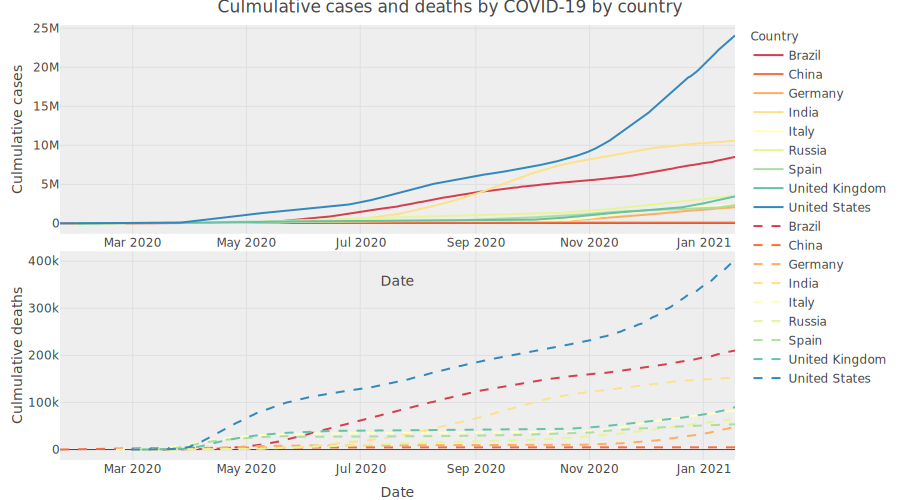
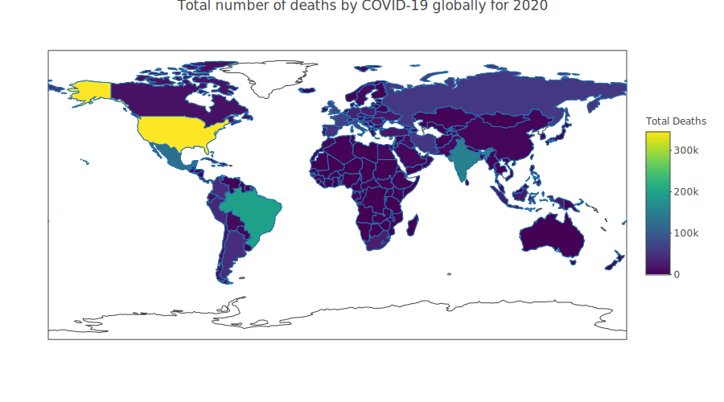
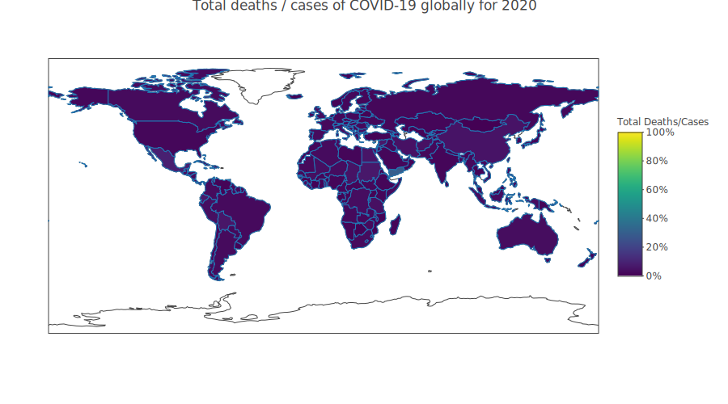
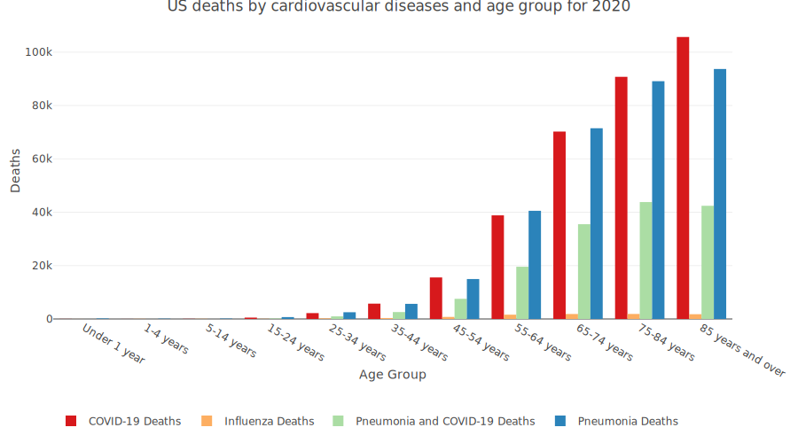

COVID-19: Age of Death in UK, US, and Globally
================
Tom Blackwood - 20023167
19/01/2021

### Main findings

  - The globally over 2020, 2.2% of COVID-19 cases result in death.
  - The average age group for deaths by COVID-19 in the US is 75-84
    years, and 1.7% of cases result in death.
  - The average age group for deaths by COVID-19 in the UK is 80-84
    years, and 2.9% of cases result in death.
  - The average age group for deaths by COVID-19 in the Scotland is
    75-84 years.

## Introduction

This is a report looking to investigate the ages of death in the
coronavirus pandemic of 2020. This report will also look at total deaths
and compare that to deaths by similar diseases in previous years to
offer a comparison between the COVID-19 deaths and deaths by other
diseases.

The inspiration for this study comes from a study performed by Dr Jason
Oke where he found that the average age of deceased COVID-19 patients
was about 79.5 years where the median was 80.5 and the range from 31 to
103. (Oke and Heneghan 2020) Starting from that study, this essay will
investigate where the average age lies with other age groups in the US,
UK, and also in Scotland.

But before looking into ages of death, this study will look at the
global cases and deaths and a value of deaths/cases or the percentage of
cases that resulted in death.

### Global analysis of COVID-19

A dataset for COVID-19 was obtained online from Our World in Data.
(Hasell 2020) The number of cases and number of deaths has been plotted
below to give a perspective of how the number of cases has compared to
the number of deaths.

For this plot a select few countries were chosen because too many
sources makes the plot too noisy. The selected countries are: United
States, United Kingdom, Germany, Spain, Russia, China, India, Brazil.
The US, Brazil, and India were chose as they seem to have rampant
numbers of cases however in the death/case rate is lower than the UK.

The number of cases for each country has been divided by the number of
deaths to give a death/case percentage or a measure of how many cases
resulted in deaths. Ideally for a country successfully treating the
virus the ratio will be low, close to zero.

 What these
plots show is the United States has the greatest increase in coronavirus
cases, followed by Brazil which is overtaken by India in September. The
number of deaths is difficult to read with respect to number of cases so
a ratio of cases over deaths is calculated.

What the deaths over cases curves show is that of the selected locations
the number of deaths vs cases peaks and then tails off at the end of
October. What’s interesting to see is that although the US has a very
high number of cases and number of death, their ratio is not as great as
Spain or the United Kingdom. Russia appears to have the lowest ratio
followed by India and Germany. China has an unusual step in their values
in the middle of April and then stays constant, and looking at the raw
data it would be because China doesn’t report many new deaths after the
15th of April.

Looking at the total number of cases across the globe for 2020 a
choropleth can be plotted to show where the hot spots of COVID-19 have
occurred. Some of the countries appear to report a very low value for
COVID-19 and this may be due to lack of testing facilities.

And interestingly the country that has suffered COVID-19 the longest
seems to be one of the countries with the least number of cases and
least number of deaths.

 Plotting
deaths divided by cases shows the probability of what percentage are
expected to die with respect to cases, and interestingly Yemen seems to
suffer the greatest number of deaths to case ratio at 29.1%. And looking
into the data of Yemen, the number of deaths they see is 610 with
respect to 2099 cases.

### US analysis of deaths vs age

The CDC published figures per state looking at age groups and deaths due
to COVID-19. (“Provisional Covid-19 Death Counts by Sex, Age, and
State\#,” n.d.) The data consists of two method of age group - “under 1
year, 1-4 years, 5-14 years,…” and “0-17 years, 18-29 years, …” and the
second set was filtered out. Additionally the data also held information
on the sexes and individual states however this essay looks at both
sexes and the deaths across the united states. The data also includes
`Pneumonia Deaths`, `Pneumonia and COVID-19 deaths`, `Influenza Deaths`,
and `Pneumonia, Influenza or COVID-19 Deaths`.

The age groups are a string integer which is difficult to find the
average value by. The average occurring index value will be looked at
instead and then rounded to an integer. The average occurring index
value will then be considered as the average occurring age group for
mortality by COVID-19. By setting the index to a column and multiplying
each index by the count of `COVID-19 Deaths` and dividing by the total
sum of the `COVID-19 Deaths`, the average row number value occurring can
be found, and this row value can be referenced into the data to pull out
the average age group for for deaths.

What is found is that the age group of 75-84 years is where the average
number of deaths lay.

From the US dataset, the COVID-19 data compared to other causes of
death, particularly pneumonia.

### UK analysis of deaths vs age

Now looking at the United Kingdom, the UK government has published data
of coronavirus *related* deaths with respect to age. (Caul, n.d.) In the
datasets the deaths recorded are as *involving COVID-19*, so they may
not specifically be due to the coronavirus, but it may have been a
contributing factor. This has the issue of obfuscating the clarity of
the reason of death.

The data from the national office of statistics was presented in an
excel spreadsheet which makes the data very tidy but hard to navigate
when importing without a bit of cleaning taking place.

For instance two slices of cells are sampled from a sheet. The first
slice holds the row names of age group and the associated data in that
row of deaths with respect to the date in the year. The second slice is
of the dates themselves as column names. The table is imported as a
matrix, transposed to have the ‘row names’ as column names, and
converted into a tibble. The ‘row names’ are not an index value so that
row of elements can be used to name the `colnames()` and then that row
is removed from the dataframe. The dates were also imported as a
dataframe but the dates themselves are imported as an excel
`date-number`. `read_excel()` recognizes and automatically converts
these numbers to a `date` type.

The date was then added to the dataset to give the values of number of
deaths by date, and summed to give total deaths for each age group.

What is found is that the age group of 80-84 is where the average number
of deaths lay.

### Scotland analysis of deaths vs age

The Scottish COVID-19 data can be obtained from the National Records of
Scotland. (“Deaths in Scotland Involving Coronavirus (Covid-19)\#,”
n.d.) This dataset has been quite difficult to work with. The `.csv`
files had to be downloaded individually for each age group. A list of
filenames looking for a pattern has to be generated and then the list is
mapped to a `read_csv()` function not just once but twice. The data
inside the `.csv` has a bit of information about the data inside the
`.csv` but after this is a blank row which the `read_csv()` function
considers as the end of file. The second `read_csv()` function run is
set to skip down to where the data begins again so that those rows may
be read in. The first `read_csv()` pulls the data detail of age group
which will be used for the column header to the main data.

The main data was read in by skipping a few rows. Then the first two
columns had to be dropped and the colnames were set to the date which
was on the first row of data. Two values of the annual totals are
included at the end of the dataset which were not required so they were
dropped as columns after the `colnames()` were set. `pivot_longer()` was
used to orientate the data from being in a wide date to having a column
of dates and an associated column of deaths, setting the deaths column
name to the age group from the first `read_csv()`. The date column had
an additional string of `"w/c "` so the `str_remove()` was used to
remove the pattern from the date column. It was then convert the date
into a `Date` type. This small dataframe was then returned to the list
that was being mapped in. After the mapping, the `reduce()` function was
run to join the lists by an `inner_join()` using the `Date` column.

And now the dataset is as a dataframe and can be plotted.

And the total deaths for each age group for COVID-19 in 2020 is plotted
below.

And again the mean occurrence of where the deaths occur in COVID-19 by
age group is 75-84 years.

## Conclusions

This has been a bit of a gradient in working with datasets. The Global
data set was easy to work with and well laid out, the `.csv` was a bit
large with extra details, and it didn’t have age specific details in it
but some plots could be made with it. The US dataset was the samilarly
easy to work with, there were age groups included with the data which
were superfluous to this essay’s needs. The UK Office of National
Statistics excel spreadsheet was initially difficult to read in as a
sheet had to be stated and a portion of cells extracted. The data had to
be manipulated and molded into a `tibble()` with a date column. The
sheets may be trimmed down in order to package the project for
submission. The scottish data was the most difficult as it was held in
different `.csv`s and a row of white space prevented the files from
being read in properly. Thankfully the data was presented in the file in
a uniform manner so a function could be written to open and read the
data by skipping over the blank row.

## References

Caul, Sarah. n.d. “Deaths Registered Weekly in England and Wales,
Provisional\#.” Online dataset published United Kingdom Office for
National Statistics.
<https://www.ons.gov.uk/peoplepopulationandcommunity/birthsdeathsandmarriages/deaths/datasets/weeklyprovisionalfiguresondeathsregisteredinenglandandwales/2020>.

“Deaths in Scotland Involving Coronavirus (Covid-19)\#.” n.d. Online
dataset published by Scottish Government; National Records of Scotland.
<https://statistics.gov.scot/resource?uri=http%3A%2F%2Fstatistics.gov.scot%2Fdata%2Fdeaths-involving-coronavirus-covid-19>.

Hasell, Mathieu, J. 2020. “A Cross-Country Database of Covid-19
Testing.” *Scientific Data*. Online dataset published by Our World in
Data. <https://doi.org/10.1038/s41597-020-00688-8>.

Oke, Jason, and Carl Heneghan. 2020. “Global Covid-19 Case Fatality
Rates.” *The Centre for Evidence-Based Medicine*.
<https://www.cebm.net/covid-19/global-covid-19-case-fatality-rates/>.

“Provisional Covid-19 Death Counts by Sex, Age, and State\#.” n.d.
Online dataset published Centers for Disease Control and Prevention.
<https://healthdata.gov/dataset/provisional-covid-19-death-counts-sex-age-and-state>.

