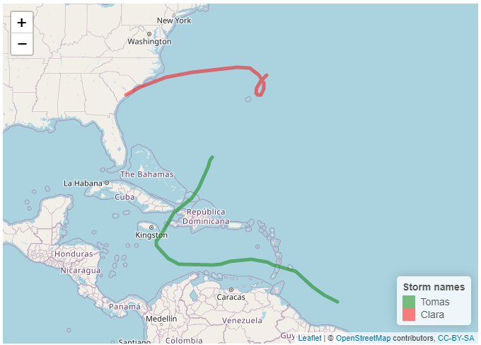

```{r setup, include=FALSE}
knitr::opts_chunk$set(echo = TRUE)
is_html = FALSE
library(tidyverse)
library(data.table)
library(leaflet)
library(rgdal)
```

## Exercise 1 - Using the `select` function

Using the `select` function pulls columns that are selected from a data frame. Using **storms** as the source, the *numerical values* can be grabbed the.

```{r storms_numeric, echo=FALSE}
select(storms, where(is.numeric))
```

or the *character values* can be used.

```{r storms_char, echo=FALSE}
select(storms, where(is.character))
```

The columns can even be selected based on looking for certain conditions, specifically here columns with *diameter* in their name

```{r storms_cont, echo=FALSE}
select(storms, contains("diameter"))
```

Using the `%like%` function from the `data.table` library, partial string matches within the columns can be selected. Here, **tropical** is used to select both *tropical depression* and *tropical storm*  

```{r storms_specific, echo=FALSE}
filter(storms, status %like% "tropical")
```

## Exercise 2 - `mutate() across() everything()`. "*Everything, sir?*", "**EVERYTHING!!!**"

Continuing with the **storms** data, the `mutate()` function combined with `across()` and `everything()` change the values of the data frame to make everything the same type. In the example below, the **storms** data is mutated using the `mutate()` function. Where the changes are set to be done across the whole data frame using `across()`, and using every data type is selected by `everything()`. The data type the selected to mutate into is *character* or `chr`. 

```{r mut_storm_chr, echo=FALSE}
mutate(storms, across(everything(), as.character))
```

The `where()` function can be used to convert data of a specific type, where you might want to keep *boolean* variables or *coordinates*, `ord`, or convert integers to floats. Here the *numerals* are being converted to *characters*.

```{r mut_storm_only_num, echo=FALSE}
mutate(storms, across(where(is.numeric), as.character))
```

## Exercise 3 - `arrange()` and `count()`

The `count()` function is used on **storms** to count the number of elements within *year* and weighted by *name*. This returns a table ordered by year. The `arrange()` function, with `desc()`, can be used to change the order of the storms to give the longest active storm by how frequently a storm name occurs in the the list by the count function.

To counter this, the `unique()` function will also be used to remove duplicate counts where *name* and *year* are both the same. (Though there may still be an error where a storm continues over the new year and it may be counted twice.). Using `unique()` removes the requirement to weight the storm by name in `count()`.

```{r storms_cnt, echo=FALSE}
select(storms, year, name) %>%
 unique() %>%
 count(vars = year, wt_vars=name) %>%
 arrange(desc(n))
```

## Exercise 4 plotting ~~schemes~~ results
 
The `select()` and `filter()` functions will be used to select data to plot with `ggplot()` from the **storms** dataset. For this the *Tomas* dataset will be selected from table (because it is a most excellent name for a storm!). The values for *name*, *wind speed*, *pressure*, and *status* are selected. *Category* was requested which gives a numeral value of the of the *status* of the storm but using *status* is a bit more informative for the layman.

```{r storm_plt, echo=FALSE}
filter(storms, name == "Tomas") %>%
 select(name, wind, pressure, status) %>%
 ggplot(aes(x=wind, y=pressure, colour=status)) + 
  geom_point()
```

Plotting more than one storm and using colour to define the different storms.

```{r storm_plt2, echo=FALSE}
filter(storms, name == c("Tomas", "Clara")) %>%
 select(name, wind, pressure, status) %>%
 ggplot(aes(x=wind, y=pressure, colour=name)) + 
  geom_point()
```

## Bonus Round

Plotting the path of Tomas and Clara using GPS coordinates. Tomas is in Green and Clara in Red. (I haven't yet worked out the `addLegend` function yet...)

```{r storm_map, echo=FALSE, out.width = "75%"}
coordsTomas <- select(filter(storms, name == "Tomas"), long, lat)
coordsClara <- select(filter(storms, name == "Clara"), long, lat)
p <- leaflet() %>%
  addTiles() %>%
  addPolylines(data = coordsTomas, lng = coordsTomas$long, lat = coordsTomas$lat, color="green") %>%
  addPolylines(data = coordsClara, lng = coordsClara$long, lat = coordsClara$lat, color="red") %>%
  addLegend(
    position = "bottomright",
    colors = c("green", "red"),
    labels = c("Tomas", "Clara"),
    title = "Storm names"
  )

if (is_html){
  p
} else {
  
}
```