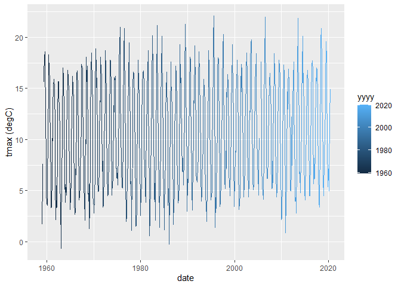

Tutorial 8
================
Tom Blackwood
02/01/2021

## Historical Weather for Braemar station

This is an R Markdown document is part of a series of reports made to
plot weather data from various train stations. This document hosts the
data from the data frame below.

``` r
head(params$data)
```

    ## # A tibble: 6 x 10
    ##   station  yyyy    mm `tmax (degC)` `tmin (degC)` `af (days)` `rain (mm)` `sun (hours)`    X8
    ##   <chr>   <dbl> <dbl>         <dbl>         <dbl>       <dbl>       <dbl>         <dbl> <dbl>
    ## 1 Braemar  1959     1           1.7          -5.7          27          NA          34.2    NA
    ## 2 Braemar  1959     2           6.2          -3.2          15          NA          68.6    NA
    ## 3 Braemar  1959     3           7.6           0.8           7          NA          80.9    NA
    ## 4 Braemar  1959     4          NA            NA            NA          NA         105      NA
    ## 5 Braemar  1959     5          15.6           4.6           1          NA         183.     NA
    ## 6 Braemar  1959     6          16.4           7.2           0          NA         165.     NA
    ## # ... with 1 more variable: date <date>

And plots like the following for `tmax (degC)` vs `date` can be made:

``` r
ggplot(params$data, aes(x = date, y = `tmax (degC)`, colour = yyyy)) + 
  geom_line()
```

<!-- -->
