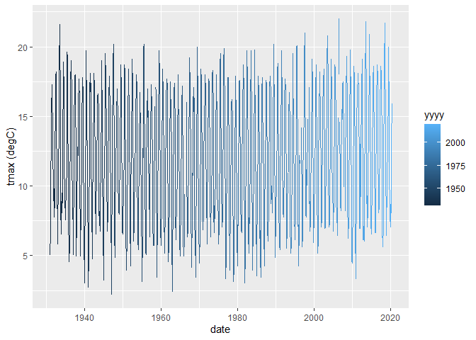

Tutorial 8
================
Tom Blackwood
02/01/2021

## Historical Weather for Nairn station

This is an R Markdown document is part of a series of reports made to
plot weather data from various train stations. This document hosts the
data from the data frame below.

    ## # A tibble: 6 x 10
    ##   station  yyyy    mm `tmax (degC)` `tmin (degC)` `af (days)` `rain (mm)` `sun (hours)`    X8
    ##   <chr>   <dbl> <dbl>         <dbl>         <dbl>       <dbl>       <dbl>         <dbl> <dbl>
    ## 1 Nairn    1931     1           5             0.6          11        78.4          43.4    NA
    ## 2 Nairn    1931     2           6.7           0.7           7        48.9          63.6    NA
    ## 3 Nairn    1931     3           6.2          -1.5          19        37.6         145.     NA
    ## 4 Nairn    1931     4          10.4           3.1           3        44.6         110.     NA
    ## 5 Nairn    1931     5          13.2           6.1           1        63.7         167.     NA
    ## 6 Nairn    1931     6          15.4           8             0        87.8         150.     NA
    ## # ... with 1 more variable: date <date>

And plots like the following for `tmax (degC)` vs `date` can be made:

<!-- -->
