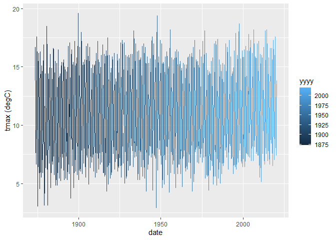

Tutorial 8
================
Tom Blackwood
02/01/2021

## Historical Weather for Stornoway station

This is an R Markdown document is part of a series of reports made to
plot weather data from various train stations. This document hosts the
data from the data frame below.

``` r
head(params$data)
```

    ## # A tibble: 6 x 10
    ##   station  yyyy    mm `tmax (degC)` `tmin (degC)` `af (days)` `rain (mm)` `sun (hours)`    X8
    ##   <chr>   <dbl> <dbl>         <dbl>         <dbl>       <dbl>       <dbl>         <dbl> <dbl>
    ## 1 Storno~  1873     7          16.7           9.9           0       110.             NA    NA
    ## 2 Storno~  1873     8          15.5           8.9           0       141              NA    NA
    ## 3 Storno~  1873     9          12.2           5.9           0       101.             NA    NA
    ## 4 Storno~  1873    10           9             2.4           2       164.             NA    NA
    ## 5 Storno~  1873    11           7.6           2.1           3        91.9            NA    NA
    ## 6 Storno~  1873    12           8.7           2.8           5       132.             NA    NA
    ## # ... with 1 more variable: date <date>

And plots like the following for `tmax (degC)` vs `date` can be made:

``` r
ggplot(params$data, aes(x = date, y = `tmax (degC)`, colour = yyyy)) + 
  geom_line()
```

<!-- -->
