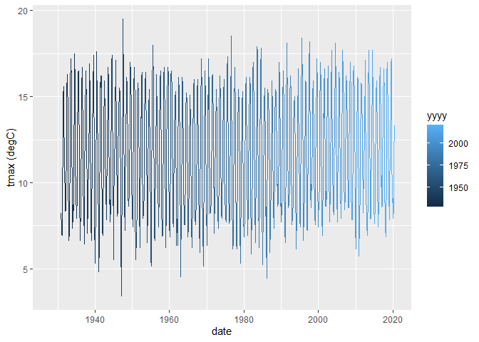

Tutorial 8
================
Tom Blackwood
02/01/2021

## Historical Weather for Tiree station

This is an R Markdown document is part of a series of reports made to
plot weather data from various train stations. This document hosts the
data from the data frame below.

``` r
head(params$data)
```

    ## # A tibble: 6 x 10
    ##   station  yyyy    mm `tmax (degC)` `tmin (degC)` `af (days)` `rain (mm)` `sun (hours)`    X8
    ##   <chr>   <dbl> <dbl>         <dbl>         <dbl>       <dbl>       <dbl>         <dbl> <dbl>
    ## 1 Tiree    1928     1            NA            NA          NA          NA          42.8    NA
    ## 2 Tiree    1928     2            NA            NA          NA          NA          59.2    NA
    ## 3 Tiree    1928     3            NA            NA          NA          NA          96.4    NA
    ## 4 Tiree    1928     4            NA            NA          NA          NA         184.     NA
    ## 5 Tiree    1928     5            NA            NA          NA          NA         250.     NA
    ## 6 Tiree    1928     6            NA            NA          NA          NA         258.     NA
    ## # ... with 1 more variable: date <date>

And plots like the following for `tmax (degC)` vs `date` can be made:

``` r
ggplot(params$data, aes(x = date, y = `tmax (degC)`, colour = yyyy)) + 
  geom_line()
```

    ## Warning: Removed 35 row(s) containing missing values (geom_path).

<!-- -->
