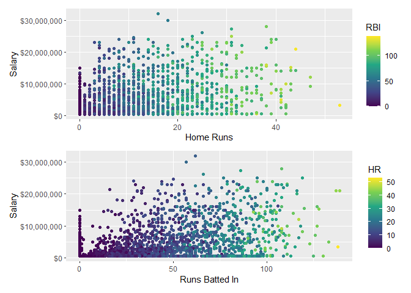
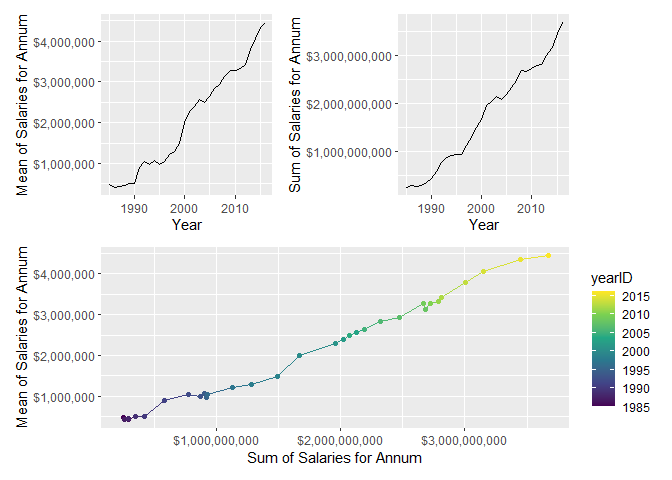

Joining Datasets
================
Tom Blackwood
06/01/2021

# Tutorial 9: Joining Datasets

## 1\. Joining Baseball `Batting` data to `Salaries` data

Using the data from the Lahman library this tutorial will join the
`Batting` data with the `Salaries` data. The players with more than 50
games since 2010 are only filtered through.

Two plots are made comparing the athlete’s Home Runs `HR` with their
`salary`, and comparing the athlete’s Runs Batted In `RBI` with their
salary. The colouring of the points was set to the opposite dynamic of
the `x`-axis.

``` r
# Pipeline to join Batting and Salaries data, filter it down to more than 50 games after 2010.
bat_sal_dat <- Batting %>%
  right_join(Salaries) %>%
  filter(., G > 50 & yearID > 2010)
```

    ## Joining, by = c("playerID", "yearID", "teamID", "lgID")

``` r
# First plot about Home Runs vs Salary
p1 <- ggplot(bat_sal_dat, aes(x = HR, y = salary, colour = RBI)) + 
  geom_point() + 
  labs(x = "Home Runs", y = "Salary") + 
  scale_y_continuous(labels = dollar_format()) + 
  scale_colour_viridis_c()

# Second plot about Runs Batted In vs Salary
p2 <- ggplot(bat_sal_dat, aes(x = RBI, y = salary, colour = HR)) + 
  geom_point() + 
  labs(x = "Runs Batted In", y = "Salary") + 
  scale_y_continuous(labels = dollar_format()) + 
  scale_colour_viridis_c()

p1 / p2
```

<!-- -->

## 1.b Joining `Pitching` to `Salaries`

Here the `Pitching` data is joined to the `Salaries` data and the
players are filtered by whether they’ve started more than 10 games since
2010.

The plots are of Earned Run Average `ERA` vs `salary` and Wins `W` vs
`salary`. The colour chosen is the again the opposite dynamic from the
`x`-axis.

``` r
# Pipline to join Salaries to Pitching data and filter by 10 games started after 2010
pit_sal_dat <- Pitching %>%
  right_join(Salaries) %>%
  filter(., GS > 10 & yearID > 2010)
```

    ## Joining, by = c("playerID", "yearID", "teamID", "lgID")

``` r
# Plot of Earned Run Average vs Salary
p1 <- ggplot(pit_sal_dat, aes(x = ERA, y = salary, colour = W)) + 
  geom_point() + 
  labs(x = "Earned Run Average", y = "Salary") + 
  scale_y_continuous(labels = dollar_format()) + 
  scale_colour_viridis_c()

# Plot of Wins vs Salary.
p2 <- ggplot(pit_sal_dat, aes(x = W, y = salary, colour = ERA)) + 
  geom_point() + 
  labs(x = "Wins", y = "Salary") + 
  scale_y_continuous(labels = dollar_format()) + 
  scale_colour_viridis_c()

p1 / p2
```

<!-- -->

## 2\. Joining `Batting` and `Pitching` data

The `Pitching` data was joined to the `Batting` data and filtered for
players who had more than 20 Home Runs and started more than 5 games.
The `People` data was then joined to the dataset so the names of players
could be derived.

The head of the resulting dataframe is shown below.

A `left_join(.)` was used which matched the `playerID`s with both
dataframes and ignores the other player rows.

``` r
bat_pitch <- select(Batting, playerID, yearID, HR) %>%
  left_join(select(Pitching, playerID, yearID, GS)) %>%
  filter(HR > 20 & GS > 5) %>%
  left_join(select(People, playerID, nameFirst, nameLast))
```

    ## Joining, by = c("playerID", "yearID")

    ## Joining, by = "playerID"

``` r
head(select(bat_pitch, playerID, nameFirst, nameLast, HR, GS))
```

    ##    playerID nameFirst nameLast HR GS
    ## 1  ruthba01      Babe     Ruth 29 15
    ## 2 ohtansh01    Shohei   Ohtani 22 10

## 3\. Joining `Salaries` with `SeriesPost`

Here the `Salaries` dataset and the `SeriesPost` dataset are semi-joined
together by matching the `Salaries$teamID` with the
`SeriesPost$teamIDwinner`. The aim of this plot is to compare the sum of
salaries and mean salaries of winning teams over the years.

The datasets a `group_by()` of their respective years is made to create
the new columns of mean salary `mean_sal` and the sum of salaries
`sum_sal` for each year. The `yearID`, `mean_sal`, and `sum_sal` are
selected from the datasets the groupings are `ungrouped()`. The
`distinct()` function removes all the duplicates.

The dataset of `winners_sal` is then plotted to show the sum of salaries
`sum_sal` vs the mean salary `mean_sal`, the mean salary vs year, and
the sum of salaries vs year.

``` r
winners_sal <- Salaries %>%
  # From Salaries select yearID, playerID, teamID, and salary so as not to 
  # get lost in data.
  select(yearID, playerID, teamID, salary) %>%
  # semi join with SeriesPost by matching teamID to teamIDwinner
  semi_join(., select(SeriesPost, yearID, teamIDwinner), by = c("teamID" = "teamIDwinner")) %>%
  # Group by yearID to sepearte the datasets
  group_by(yearID) %>%
  # Find the mean value of the salary
  mutate(., mean_sal = mean(salary)) %>%
  # Find the sum of all the salaries
  mutate(., sum_sal = sum(salary)) %>%
  # Select only the year, mean_sal, and sum_sal
  select(., yearID, mean_sal, sum_sal) %>%
  # Ungroup the data
  ungroup() %>%
  # Remove duplicate entries
  distinct()
  
winners_sal
```

    ## # A tibble: 32 x 3
    ##    yearID mean_sal   sum_sal
    ##     <int>    <dbl>     <dbl>
    ##  1   1985  474208. 247536802
    ##  2   1986  413861. 293427260
    ##  3   1987  432886. 259731876
    ##  4   1988  454339. 288505036
    ##  5   1989  503501. 344897878
    ##  6   1990  507405. 422161193
    ##  7   1991  886832. 579988417
    ##  8   1992 1043023. 770793989
    ##  9   1993  979968. 873151800
    ## 10   1994 1059484. 902680069
    ## # ... with 22 more rows

``` r
p1 <- ggplot(winners_sal, aes(x = sum_sal, y = mean_sal, colour = yearID)) + 
  geom_line() + 
  geom_point() +
  labs(x = "Sum of Salaries for Annum", y = "Mean of Salaries for Annum") + 
  scale_x_continuous(labels = dollar_format()) +
  scale_y_continuous(labels = dollar_format()) + 
  scale_colour_viridis_c()

p2 <- ggplot(winners_sal, aes(x = yearID, y = mean_sal)) + 
  geom_line() + 
  labs(x = "Year", y = "Mean of Salaries for Annum") + 
  scale_x_continuous() +
  scale_y_continuous(labels = dollar_format())

p3 <- ggplot(winners_sal, aes(x = yearID, y = sum_sal)) + 
  geom_line() + 
  labs(x = "Year", y = "Sum of Salaries for Annum") + 
  scale_x_continuous() +
  scale_y_continuous(labels = dollar_format())

(p2 + p3) / p1
```

<!-- -->
